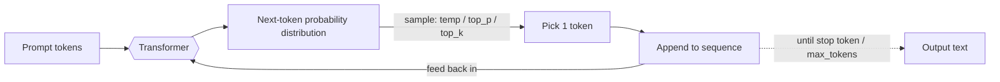
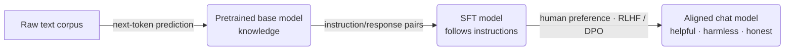

# LLM Foundations — Concepts

> How LLMs work: tokens, context window, decoding, hallucinations

## Overview
An LLM is a **next-token predictor**. It never sees words — it sees **tokens** (sub-word units). Given all the tokens so far, it outputs a probability distribution over the next token, samples one, appends it, and repeats. That single loop — **autoregressive generation** — explains both why it's fluent and why it hallucinates: it's optimized to produce *likely* text, not *true* text. Everything else I build (RAG, agents, cost work) sits on top of this.

**The generation loop (whiteboard version):**


## Key ideas
- **Tokenization:** text → sub-word tokens. Rule of thumb: **1 token ≈ 4 characters ≈ 0.75 words**. Both my input and the model's output are billed and length-limited in tokens.
- **Autoregressive generation:** predict next-token distribution → sample → append → repeat. It's not retrieving an answer; it's extending the sequence one token at a time.
- **Context window:** the max tokens the model can attend to at once = **prompt + output combined** (e.g. 200K). Overflow **silently drops** information — no error, the model just can't see it.
- **Lost in the middle:** even *within* the window, facts at the **start and end** are recalled far more reliably than facts in the **middle**. → keep context lean, put critical instructions/facts at the edges. (Ties to topic 21.)
- **Decoding controls sampling:**
  - **Greedy** — always the top token; deterministic, can loop/repeat.
  - **Temperature** — randomness. ~0 = factual/deterministic; 0.8–1.2 = creative.
  - **top_p (nucleus)** — sample from smallest token set with cumulative prob ≥ p (e.g. 0.9).
  - **top_k** — sample from the top k tokens only.
- **Cost & latency scale with total tokens (input + output).** Output tokens are the expensive, slow part — they're generated **one at a time**, so latency is dominated by *how much the model writes*, not how much it reads.

## Deep dives
- **Why hallucinations happen:** the model has no built-in notion of truth or "I don't know." Trained to emit fluent, high-probability text, so under knowledge gaps, ambiguity, outdated parametric memory, or over-long context it produces the most plausible-sounding tokens anyway. A bigger model is more fluent → can be *more confidently* wrong.
- **Layered defence against hallucination (defence in depth — never one trick):**
  1. **RAG / grounding** — answer only from retrieved chunks, not parametric memory.
  2. **Chain-of-thought** — force step-by-step reasoning; skips fewer facts than jumping to a conclusion.
  3. **Output validation / guardrails** — verifier model or NLI entailment classifier flags unsupported claims.
  4. **Constrained decoding** — function calling / JSON schema when the answer is bounded to N options.
  5. **Confidence + abstention** — use log-probs or self-consistency; **abstain when low** rather than guess.
- **Measuring hallucination:** faithfulness eval (RAGAS), NLI entailment against sources, human spot-check. "You can't fix what you don't measure."
- **Confidence signals:**
  - **Perplexity** — how "surprised" the model is by text; lower = more predictable (rough fluency/confidence proxy).
  - **Log-probs** — per-token confidence; threshold to decide when to abstain.
  - **Self-consistency** — sample N answers, take the majority; costs N× tokens, worth it on hard reasoning where correctness matters more than latency.
- **Decoding in practice:** temperature ~0 for extraction/classification/structured output; raise only for ideation. Cheapest reliability lever available.

## Architecture & training (how the model got here)

**Transformer block (whiteboard version) — repeat ×N, then project to next-token logits:**
```
            ┌───────────────────────────────────┐
 tokens ───►│  token embeddings + positional enc │
            ├───────────────────────────────────┤
            │  Multi-Head Self-Attention         │  ← each token emits Q, K, V
            │     Q·Kᵀ → softmax → weight · V     │     "soft learned lookup"
            │  + residual  + layer norm          │
            ├───────────────────────────────────┤
            │  Feed-Forward (MLP)                │
            │  + residual  + layer norm          │
            └───────────────────────────────────┘
                          │  ×N layers
                          ▼
                 next-token logits ──► softmax ──► distribution
```

- **Transformer core:** processes all tokens **in parallel** and uses **self-attention** so each token can look at every other token and weigh which matter for the next prediction. Parallelism (vs. RNN/LSTM one-token-at-a-time) is *why* it scaled.
- **Self-attention (Q/K/V):** each token emits a **Query** ("what am I looking for"), **Key** ("what I offer"), **Value** ("what I contribute"). Match queries to keys → softmax weights → weighted blend of values. It's a **soft, learned lookup** over the sequence.
- **Multi-head attention:** several attention patterns in parallel (one head may track syntax, another coreference), then combined → richer representation.
- **Positional encoding:** no recurrence means order isn't implicit, so position is injected (sinusoidal or learned; modern models use RoPE etc.).
- **Also in the block:** feed-forward layers, residual connections, layer norm; stacked N times.
- **Architecture flavors (know *why* each):**
  - **Decoder-only** (GPT, Claude, Llama) — **causal/masked** attention (can't see future tokens), next-token objective → **chat & generation**. Most LLMs today.
  - **Encoder-only** (BERT) — **bidirectional**, sees whole input at once → **embeddings, classification, retrieval** (ties to [[03-embeddings-vector-search]]).
  - **Encoder-decoder** (T5, original 2017 Transformer) — encoder reads, decoder writes → **translation, summarization**.
- **Training lifecycle:**

  1. **Pretraining** — next-token prediction over huge unlabeled corpora → raw knowledge & capability (the expensive part).
  2. **SFT (supervised fine-tuning)** — train on curated instruction→response pairs → learns to *follow instructions*.
  3. **RLHF / DPO** — align to human preferences (reward model + RL, or Direct Preference Optimization) → helpful, harmless, honest.
  - One-liner: *"Pretraining gives it knowledge, SFT gives it obedience, RLHF gives it manners."*
- **vs. traditional NLP:** classic NLP trained a **separate model per task** (TF-IDF + classifier, RNN seq2seq, NER pipelines). A pretrained transformer is **one model that does many tasks zero-/few-shot** via prompting — that's the paradigm shift. (Detailed knowledge of RNN/LSTM/TF-IDF is legacy for GenAI roles; know the contrast, not the internals.)

## Common misconceptions
- ❌ "The model looks things up." → It predicts tokens from learned patterns; no lookup unless I add retrieval (RAG).
- ❌ "A bigger context window means better answers." → Attention degrades over long contexts (lost-in-the-middle, context rot); more tokens can *hurt* and always cost more.
- ❌ "Temperature 0 stops hallucinations." → It only removes randomness; a confidently-wrong greedy answer is still wrong. Grounding + validation is what reduces hallucination.
- ❌ "Input and output tokens cost the same." → Output typically costs **~4–5×** input and dominates latency.
- ❌ "Prompting for JSON = constrained decoding." → Prompting *asks*; constrained decoding / function calling *enforces* the structure at the sampling layer.
- ❌ "Transformers process text left-to-right like RNNs." → They process all tokens **in parallel**; a *decoder* just **masks** future tokens so it can't peek — the parallelism is still there.
- ❌ "Attention means the model 'focuses' like a human." → It's weighted averaging of Values via Query–Key similarity; a math operation, not cognition.
- ❌ "Fine-tuning is how models learn language." → Language/knowledge comes from **pretraining**; SFT/RLHF just shape behavior and alignment.

---
_Related: [[04-rag]] · [[02-prompt-engineering]] · [[09-cost-optimization]] · [[21-context-engineering]] · [[08-evaluation]]_
