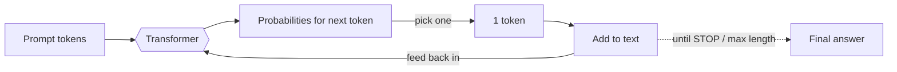
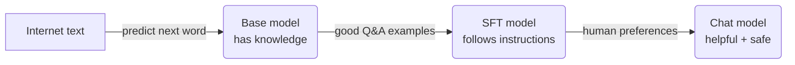
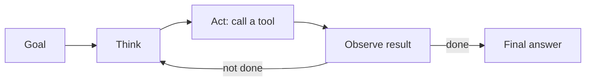
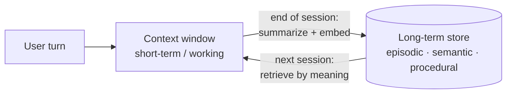

# LLM Foundations — Concepts

> Read this top-to-bottom the first time. Each idea = **plain definition → example → why it matters**.
> This is the **map** — a few topics (embeddings, prompt/context/orchestration) have their own deep folders; here you get the beginner-friendly version + a pointer.
> Cheatsheet (`cheatsheet.md`) is for revising *after* you understand these.

---

## 1. The big picture (AI → ML → GenAI → LLM)

**Definition:** These words nest inside each other like Russian dolls.

```
AI  ── machines doing "smart" things
 └─ Machine Learning (ML) ── learns patterns from data instead of hard-coded rules
     └─ Deep Learning ── ML using big neural networks
         └─ Generative AI (GenAI) ── creates NEW content (text, images, audio)
             └─ LLMs ── GenAI for text (ChatGPT, Claude, Llama)
```

**Example:** "Detect spam" is plain ML. "Write me an email" is GenAI. "Write me an email using GPT" is an LLM.

**Why it matters:** Interviewers open with *"where does GenAI sit in AI?"* — this ladder is the clean answer. **GenAI is a slice of deep learning that generates content; LLMs are the text slice of GenAI.**

---

## 2. What is an LLM?

**Definition:** A **Large Language Model** is a program trained on huge amounts of text that does one thing — **guess the next word** (token) over and over. It's also called a **foundation model** because one model can be reused for many tasks (chat, summarize, code) without retraining.

**Example:** You type `"The capital of France is"` → it predicts `"Paris"`. You type `"def add(a, b): return"` → it predicts `"a + b"`. Same model, different tasks.

**Why it matters:** Everything an LLM does — answering, coding, reasoning — is this one next-word skill dressed up. If you remember nothing else: **it predicts likely text, it does not "know" facts.**

---

## 3. Where NLP fits

**Definition:** **NLP (Natural Language Processing)** is the whole field of getting computers to work with human language — translation, sentiment, summarization, question-answering. LLMs are simply the **modern, dominant way** to do NLP.

**Example:** "Is this review positive or negative?" used to need a custom-trained NLP classifier. Today you just ask an LLM. Same NLP *task*, new *tool*.

**Why it matters:** If asked *"how is this different from old NLP?"* → *"Old NLP built one narrow model per task; LLMs are one general model that does most NLP tasks out of the box via prompting."*

---

## 4. Generative AI vs Traditional ML

**Definition:** Traditional ML **picks a label** ("spam / not spam"). Generative AI **creates new content** that looks like its training data.

**Example:**
- Traditional ML: email in → `"spam"` (one of a fixed set of answers).
- GenAI: `"write a reply declining this meeting"` → a brand-new paragraph that never existed before.

| | Traditional ML | Generative AI |
|---|---|---|
| Output | A label / number | New content (text, image, code) |
| Model per task? | Usually one model per task | One model, many tasks |
| Example | Fraud detection | ChatGPT, Claude |

**Why it matters:** A very common opener. One line: *"Traditional ML classifies or predicts; generative AI creates — and one foundation model handles many tasks instead of one model per task."*

---

## 5. Tokens

**Definition:** The model doesn't read words — it reads **tokens** (chunks of words). Rough rule: **4 characters ≈ 1 token**, or **1 word ≈ 1.3 tokens**.

**Example:**
- `"cat"` → 1 token
- `"unbelievable"` → 3 tokens: `un` + `believ` + `able`
- `"The cat sat."` → about 4 tokens

**Why it matters:** You are **billed per token**, and the memory limit is measured in tokens. A 10-page doc ≈ 5,000 tokens — that's what you pay for and what fills the window.

---

## 6. Embeddings (turning meaning into numbers)

**Definition:** An **embedding** is a list of numbers (a vector) that captures the *meaning* of text, so things with similar meaning end up **close together** in number-space.

**Example:**
- `"dog"` and `"puppy"` → vectors that are **near** each other.
- `"dog"` and `"car"` → vectors that are **far apart**.
- Famous one: `king − man + woman ≈ queen` (the math actually works on meanings).

**Why it matters:** This is how **search and RAG** work — turn your question and your documents into vectors, then find the closest ones. Foundational for topic [[03-embeddings-vector-search]]. Interview line: *"Embeddings turn meaning into geometry so 'similar' becomes 'close'."*

---

## 7. How an LLM generates text (autoregressive)

**Definition:** "Autoregressive" just means **one token at a time, feeding its own output back in.** Predict next token → add it → predict the next → repeat, until it decides to stop.

**Example:**
```
Prompt:  "The sky is"
Step 1 → predicts: blue (0.7), clear (0.15), dark (0.05)...  picks "blue"
Now:     "The sky is blue"
Step 2 → predicts: today, and, .   picks "today"
Now:     "The sky is blue today"   ... continues until a STOP token
```

**Diagram:**


**Why it matters:** Because it writes one token at a time, **longer answers are slower and cost more.** This is why "be concise" actually saves money and latency.

---

## 8. Parameters & scale (what "7B" means)

**Definition:** **Parameters** are the numbers (weights) the model learned during training. "7B" = 7 billion of them. More parameters = more capacity, but more cost and slower.

**Example:** Llama comes in **8B** (small, cheap, fast) and **70B** (smarter, pricier). GPT-3 was **175B**. Rule of thumb: use the **smallest model that passes your quality bar**.

**Why it matters:** Ties straight to cost. Interview line: *"I match model size to task difficulty — small model for classification, big model only for hard reasoning."* (→ [[09-cost-optimization]])

---

## 9. The Transformer & self-attention

**Definition:** The **Transformer** is the architecture inside every modern LLM. Its key trick is **self-attention**: when processing a word, the model looks at **all the other words** and decides which ones matter.

**Example:** In `"The animal didn't cross the street because it was too tired"` — what is `"it"`? Attention lets the model link `"it"` → `"animal"` (not `"street"`).

**How attention works (simple version):** each word asks a **Question** ("what am I looking for?"), every word offers a **Key** ("here's what I am") and a **Value** ("here's what I contribute"). The model matches questions to keys, then blends the values — a **smart lookup**.

**Diagram — the Transformer block (repeats N times):**
```
            ┌───────────────────────────────────┐
 tokens ───►│  word embeddings + position info   │
            ├───────────────────────────────────┤
            │  Self-Attention (look at all words)│  ← Q · K → weights → blend V
            ├───────────────────────────────────┤
            │  Feed-Forward (think about it)     │
            └───────────────────────────────────┘
                          │  × N layers
                          ▼
                 prediction for the next token
```

**Why it matters:** Old RNNs read one word at a time and forgot long-range links. Transformers look at **everything at once**, in parallel — that's what let them scale. Interview line: *"The win over RNNs is parallelism plus long-range attention."*

---

## 10. Architecture flavors (decoder / encoder / both)

**Definition:** Same Transformer building block, wired three ways:

| Type | Sees | Best at | Examples |
|---|---|---|---|
| **Decoder-only** | Only past words (can't peek ahead) | **Generating** text, chat | GPT, Claude, Llama |
| **Encoder-only** | The whole input at once | **Understanding** — embeddings, classification | BERT |
| **Encoder-decoder** | Reads all, then writes | Translation, summarization | T5 |

**Why it matters:** Explains *"why are chat models decoder-only but embedding models encoder-based?"* → **generating** predicts the next word from the past; **understanding/search** benefits from seeing the whole sentence at once. (→ [[03-embeddings-vector-search]])

---

## 11. How an LLM is trained (3 stages)

**Definition:** A chat model is built in three steps:

1. **Pretraining** — read the internet, predict the next word → gains **knowledge**. (The expensive part.)
2. **SFT (Supervised Fine-Tuning)** — show it good `question → answer` examples → learns to **follow instructions**.
3. **RLHF** (Reinforcement Learning from Human Feedback) **/ DPO** (Direct Preference Optimization) — humans rank answers, model learns the preferred style → becomes **helpful, harmless, honest**. (DPO is the newer, simpler alternative — it skips RLHF's separate reward model and trains directly on the "A is better than B" pairs.)

**Diagram:**


**One-liner:** *"Pretraining gives it knowledge, SFT gives it obedience, RLHF gives it manners."*

**Why it matters:** Knowledge comes from **pretraining** — so if the model doesn't *know* something, fine-tuning won't add facts; **RAG** is the fix. (→ [[07-fine-tuning]], [[04-rag]])

---

## 12. GPT & the major model families

**Definition:** **GPT = Generative Pre-trained Transformer.** The name is just the three things you've already learned stacked together:
- **Generative** — it creates text (§4).
- **Pre-trained** — first trained on huge text to predict the next word (§11).
- **Transformer** — the architecture inside it (§9), specifically **decoder-only** (§10).

So "GPT" isn't magic — it's a decoder-only transformer that was pre-trained and then aligned.

**Example — the big families (all decoder-only LLMs, different makers):**

| Family | Maker | Note |
|---|---|---|
| **GPT** (GPT-4o, o-series) | OpenAI | The name that made "GPT" famous |
| **Claude** | Anthropic | What you build with at IBM |
| **Llama** | Meta | Open-weight — you can self-host |
| **Gemini** | Google | Multimodal-first |

**Why it matters:** A common warm-up is *"what does GPT stand for?"* — answering **"Generative Pre-trained Transformer, i.e. a decoder-only transformer that's pre-trained then aligned"** shows you understand the parts, not just the buzzword. Also lets you talk about **open (Llama) vs closed (GPT/Claude/Gemini)** models — a real architecture-choice question.

---

## 13. Types of language models (LLM, SLM, and friends)

**Definition:** Same core idea (a transformer predicting tokens), sorted by **size** and **specialty**:

| Type | What it is | Runs where | Examples |
|---|---|---|---|
| **LLM** (Large) | Billions of params, general-purpose, most capable | Cloud / GPU | GPT-4o, Claude, Llama 70B |
| **SLM** (Small) | Few hundred M – a few B params; cheaper, faster, narrower | Laptop / phone / edge | Phi-3, Gemma, Llama 3.2 1B/3B |
| **MoE** (Mixture of Experts) | Huge total params, but only a few "experts" fire per token → big-model quality at lower run cost | Cloud | Mixtral, many frontier models |
| **Reasoning model** (LRM) | Trained to "think" step-by-step before answering; better at math/logic, slower + pricier | Cloud | o-series, Claude (thinking) |
| **Multimodal** (LMM / MLLM) | Also takes images / audio, not just text | Cloud | GPT-4o, Gemini |

**Example:** A phone keyboard's next-word suggestion can run a **SLM** on-device (private, no network). A hard legal-document analysis needs a cloud **LLM** (or a reasoning model).

**Why it matters:** The classic design trade-off. Interview line: *"I'd use a small on-device SLM when latency, cost, or privacy matter, and a large cloud LLM only when the task needs the extra reasoning."* Ties to [[09-cost-optimization]] and edge deployment.

---

## 14. In-context learning (zero / one / few-shot)

**Definition:** LLMs can learn a task **from examples in the prompt** — no retraining. Give it examples in the message and it copies the pattern.

**Example — few-shot classification:**
```
Classify the sentiment.

Review: "Loved it, works great!"   → Positive
Review: "Total waste of money."    → Negative
Review: "It's okay, nothing special." →
```
The model outputs `Neutral` — it learned the format from your 2 examples.

- **Zero-shot** = no examples, just ask.
- **One-shot** = one example.
- **Few-shot** = a handful of examples.

**Why it matters:** The cheapest way to steer a model — try examples **before** you ever consider fine-tuning. (→ [[02-prompt-engineering]])

---

## 15. Context window

**Definition:** The **context window** is the model's short-term memory — the max tokens it can consider at once, counting **your prompt + its answer together**.

**Example:** A 200K-token window ≈ **150,000 words** ≈ a 500-page book. If you paste more than fits, the **oldest text silently falls off** — no error, the model just can't see it.

**"Lost in the middle":** even inside the window, the model remembers the **start and end** better than the **middle**. Put critical instructions at the top or bottom.

**Why it matters:** Bigger window ≠ better answers. Stuffing it costs more and can *hurt* accuracy. (→ [[21-context-engineering]])

---

## 16. Decoding settings (temperature, top_p, top_k)

**Definition:** After the model has the probabilities, these settings control **how it picks** the next token — more predictable vs more creative.

**Example — same prompt `"Write a coffee tagline"`:**
- `temperature = 0` → same safe answer every time: *"Great coffee, every day."*
- `temperature = 1` → varied, creative: *"Sip the sunrise."*, *"Fuel your chaos."*

```python
# Factual task → low temperature
client.chat(prompt, temperature=0)      # deterministic, repeatable

# Brainstorming → higher temperature
client.chat(prompt, temperature=0.9)    # varied, creative
```

- **temperature** — the main knob: 0 = focused/factual, high = creative/random.
- **top_p** — only consider tokens making up the top p% of probability (e.g. 0.9).
- **top_k** — only consider the top k tokens.

**Why it matters:** The cheapest reliability lever there is. *"I keep temperature near 0 for extraction and classification, and only raise it for brainstorming."*

---

## 17. Hallucinations

**Definition:** A **hallucination** is when the model states something false **confidently**. It happens because the model produces *likely-sounding* text, not *true* text — and it has no built-in "I don't know."

**Example:** Ask *"Which two Nobel Prizes did Einstein win?"* — he won **one** (Physics, 1921). But a confident answer is statistically "more likely" than admitting there was only one, so the model may **invent a second prize**.

**How to reduce it (layers, not one trick):**
1. **RAG** — give it the real documents, say "answer only from these."
2. **Chain-of-thought** — ask it to reason step by step.
3. **Output check** — a second pass / validator flags unsupported claims.
4. **Let it say "I don't know"** — abstain instead of guessing.

**Why it matters:** The #1 reason companies distrust LLMs in production. Power move: *"No single fix — RAG plus output validation, defence in depth."* (→ [[10-safety-guardrails]], [[08-evaluation]])

---

## 18. Knowing when it's unsure (bonus)

- **Log-probs** — the model's confidence per token; low confidence → maybe abstain.
- **Self-consistency** — ask the same question 5 times, take the **majority answer**; costs 5× but boosts reliability on hard reasoning.

---

## 19. Prompt vs Context vs Orchestration engineering ⭐

**Definition:** Four "engineering" disciplines that people mix up. They're a **ladder** — each one wraps the previous.

| Discipline | What you control | Scope | Deep topic |
|---|---|---|---|
| **Prompt engineering** | The **wording** of one request | A single message | [[02-prompt-engineering]] |
| **Context engineering** | **Everything the model can see** — system prompt, RAG chunks, memory, history, tool outputs | One whole task/session | [[21-context-engineering]] |
| **Loop engineering** | **How the agent's think→act loop runs** — max iterations, stop condition, retries, budget guards | One agent's control flow | [[05-agents-tool-use]] |
| **Orchestration engineering** | **How many agents/steps** you wire together and how they hand off | A multi-agent system | [[22-agent-orchestration]] |

**Example:**
- *Prompt:* "Summarize this in 3 bullets." ← you tuned the words.
- *Context:* also feed it the last 5 emails + a style guide + retrieved docs. ← you tuned what it sees.
- *Loop:* let the agent retry a failed tool up to 3 times, then stop after 10 steps. ← you tuned how it iterates.
- *Orchestration:* one agent fetches data, a second drafts, a third reviews. ← you tuned the pipeline.

**Why it matters:** A senior-signal distinction. One-liner: *"Prompt = what you say; context = everything the model can see; loop = how the single agent iterates and when it stops; orchestration = how many agents you wire together."*

---

## 20. The agent loop (looping)

**Definition:** An **agent** doesn't answer once — it runs a **loop**: think → act (call a tool) → see the result → think again → … until the task is done.

**Diagram:**


**Example:** "Book me the cheapest flight." → *think* "I need prices" → *act* call flight API → *observe* results → *think* "cheapest is 9am" → *act* book it → *done*.

**Why an unguarded loop is dangerous:** without limits it can run forever or burn huge cost. Guards: **max iterations**, **token/cost budget**, and a clear **stop condition**.

**Why it matters:** *"Every autonomous loop needs a max-iteration cap, a budget guard, and a clear termination condition — otherwise it's a runaway."* (→ [[05-agents-tool-use]], [[22-agent-orchestration]])

---

## 21. Memory (types & the human analogy)

**Definition:** An LLM is **stateless** — by itself it remembers nothing between calls. "Memory" is something *you* engineer around it. The easiest way to hold the types is to map them to **human memory**:

| Human memory | AI equivalent | What it holds |
|---|---|---|
| Short-term | **Context window** | The current conversation |
| Long-term | **Database / vector store** | Anything that must survive across sessions |
| Experience | **Episodic memory** | Past events/interactions ("last time we deployed, X broke") |
| Facts | **Semantic memory** | Stable facts ("the user's project uses Postgres") |
| Skills | **Procedural memory** | How to do things — system prompt, tools, learned steps |

**Two ways people slice memory:**

**(a) By lifetime**
- **Short-term / working memory** — lives *inside* the context window; gone when the window fills or the chat ends.
- **Long-term memory** — stored *outside* the model (DB, files, vectors); pulled back in when relevant.

**(b) By what it stores** — episodic (experiences), semantic (facts), procedural (skills), as in the table above.

**Other memory terms you'll hear:**
- **Working memory** — the active scratchpad the agent reasons in right now (a slice of short-term).
- **Scratchpad** — a temporary notes area the agent writes to mid-task, then discards.
- **Contextual memory** — whatever's relevant to *this* task/session, assembled into the window.
- **Entity memory** — facts tracked per entity ("user = Prasad, employer = IBM, prefers Python").
- **Tool memory** — results/state returned from tool calls, kept for later steps.
- **Vector memory** — long-term memory stored as **embeddings** so you can retrieve by *meaning* (this is the RAG mechanism).

**Example:**
- *Short-term:* in one chat it recalls "my name is Prasad" because it's still in the window.
- *Long-term (vector):* a note *"user prefers Python"* is embedded and saved; next week a new chat retrieves it by similarity and the assistant already knows.

**Diagram:**


**How memory is stored (techniques):**

| Technique | What it does | Trade-off |
|---|---|---|
| **Full buffer** | Keep the entire conversation in the window | Simplest; but fills the window fast |
| **Sliding window** | Keep only the last N turns | Cheap; loses older context |
| **Summarization / compaction** | Compress old turns into a short summary, then continue | Saves tokens; a bad summary drops a needed detail |
| **Vector store** | Embed chunks, retrieve by meaning (RAG) | Scales to huge history; retrieval can miss/mis-rank |
| **Key-value / structured store** | Save exact facts (user profile, settings) | Precise; you must decide what to write |
| **Knowledge graph** | Store entities + relationships | Powerful for linked facts; more to build |

**Real tools people use (name-drop these):**

| Memory kind | Typical tool |
|---|---|
| Chat / session memory | **Redis**, session store |
| Long-term structured | **Postgres**, **MongoDB** |
| Vector memory | **Pinecone**, **Weaviate**, FAISS, pgvector |
| Agent state | **LangGraph** state machine |
| Tool history | **JSON logs** |

**Challenges / failure modes (name these — senior signal):**

| Problem | What it means |
|---|---|
| **Context overflow** | Too much chat history — it fills the window and older info drops |
| **Memory drift** | The system remembers info *incorrectly* over time |
| **Stale memory** | Stored data is outdated (fact changed, memory didn't) |
| **Retrieval noise** | The *wrong* memories get retrieved for the query |
| **Memory hallucination** | Fake "remembered" facts — a hallucination got saved and reused as truth |
| **Cost / privacy** | Memory eats tokens (cost) and long-term PII needs consent + deletion |

**Why it matters:** *"The model is stateless; memory is engineered — short-term is whatever fits in the window, long-term is retrieved from a store, usually as vectors. By type it's episodic (experiences), semantic (facts), procedural (skills). The hard parts are retrieval quality, staleness, and cost."* Bridges straight into [[03-embeddings-vector-search]] and [[21-context-engineering]].

---

## Quick misconceptions to avoid
- ❌ "It looks facts up." → No — it predicts from patterns. Add **RAG** for real facts.
- ❌ "Bigger context window = better." → It can cost more and *hurt* (lost in the middle).
- ❌ "Temperature 0 stops hallucinations." → It only removes randomness; a confident wrong answer is still wrong.
- ❌ "Fine-tuning teaches it new facts." → Facts come from pretraining; use **RAG** for knowledge, fine-tuning for **style/format**.
- ❌ "Prompt engineering and context engineering are the same." → Prompt = the words; context = everything the model sees.

---
_Related: [[03-embeddings-vector-search]] · [[04-rag]] · [[02-prompt-engineering]] · [[21-context-engineering]] · [[22-agent-orchestration]] · [[09-cost-optimization]] · [[08-evaluation]]_
