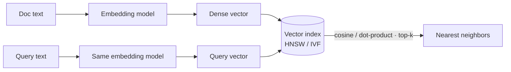

# Embeddings & Vector Search — Concepts

> Dense vectors, similarity, ANN/HNSW, vector databases

## Diagram (whiteboard version)

> Key point: **query and documents must use the same embedding model**. ANN (HNSW/IVF) trades a little recall for huge speed vs exact search.

## Overview
_Your study notes go here. Explain it like you would to an interviewer._

## Key ideas
- 

## Deep dives
- 

## Common misconceptions
- 
