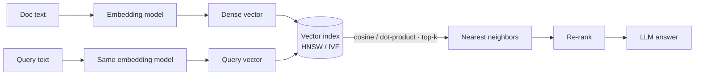

# Embeddings & Vector Search — Concepts

> Read top-to-bottom the first time. Each idea = **plain definition → everyday analogy → why it matters**.
> This is a **deep folder** — [[02-llm-foundations]] gives the 1-paragraph version; here's the full picture.
> Cheatsheet (`cheatsheet.md`) is for revising *after* you understand these.

---

## 1. What is an embedding (a GPS coordinate for meaning)

**Definition:** An **embedding** turns a piece of text (or image/audio) into a **list of numbers** (a vector) that captures its *meaning*. Things that mean similar things get vectors that sit **close together**.

**Example — a map of a city:** every word/sentence gets an address on a giant "map of meaning." **"coffee"** and **"tea"** are on the same street; **"coffee"** and **"football"** are across town. To find related text you just look for the **nearest addresses** — not matching letters, but matching meaning.

**Why it matters:** This is why search finds *"how do I reset my password"* when the doc says *"recover your account login"* — no shared keywords, but nearby meaning. It's the engine under semantic search, RAG, recommendations, and dedup. One-liner: *"Embeddings turn meaning into geometry, so 'similar' becomes 'close'."*

---

## 2. The vector space & dimensions

**Definition:** Each embedding is a fixed-length list of numbers — e.g. **1536 dimensions** for OpenAI `text-embedding-3-small`. Each dimension is one "axis of meaning." More dimensions = more nuance, but more memory and slower search.

**Example:** a city map needs only 2 numbers (lat, long). Meaning is far richer, so we use hundreds/thousands of axes — "formality," "topic," "sentiment," and thousands of blends the model learned on its own. You can't picture 1536-D, but the math of "close together" works exactly the same as on a 2-D map.

**Why it matters:** Dimensionality is a cost/quality lever. *"Higher dims capture more nuance but cost more to store and search — I match it to the task."* Some models (Matryoshka embeddings) let you **truncate** dimensions to trade accuracy for speed.

---

## 3. Similarity measures — cosine vs dot vs Euclidean

**Definition:** Three ways to measure "how close are two vectors":
- **Cosine similarity** — the **angle** between them (direction only, ignores length). Most common for text.
- **Dot product** — angle **and** magnitude (longer vectors score higher).
- **Euclidean (L2)** — straight-line distance between the two points.

**Example — which way are you facing:** cosine asks *"are these two people facing the same direction?"* regardless of how far each walked. Two docs about "dogs" point the same way even if one is a tweet and one is an essay — cosine says they're similar; Euclidean might call them far apart just because one is longer.

**Why it matters:** Pick to match how the model was trained. *"I default to cosine for text because it compares meaning-direction and ignores document length; if vectors are normalized, cosine and dot product are equivalent."*

---

## 4. Choosing an embedding model (benchmark on YOUR data)

**Definition:** Embedding models differ in dimensionality, domain, language support, max input length, and cost. **MTEB** is a public leaderboard, but the leaderboard winner isn't automatically best for you.

**Example — hiring for a specific job:** a candidate topping a general aptitude test may still flop at *your* niche task (legal contracts, medical notes). So you run a small **bake-off on your own labeled queries** and pick the model that retrieves *your* right answers.

**Why it matters:** The classic senior line: *"I benchmark on my own data, not just MTEB."* Also: **query and documents must use the same embedding model** — mixing models is like comparing addresses from two different maps.

---

## 5. Exact vs Approximate Nearest Neighbor (why brute force breaks)

**Definition:** To find the top-k closest vectors, **exact search** compares the query to *every* vector — accurate but O(N), too slow past a few hundred thousand. **ANN (Approximate Nearest Neighbor)** trades a tiny bit of accuracy (**recall**) for a huge speed/memory win.

**Example — finding the nearest coffee shop:** exact = measure the distance to *every* shop in the whole city (perfect but slow). ANN = check your own neighborhood and a couple next door (near-instant; very occasionally you miss a slightly-closer shop one district over).

**Why it matters:** *"Below ~100k vectors, exact search is fine; above that I use an ANN index and tune recall vs latency."* Knowing *when* you need ANN is as important as knowing what it is.

---

## 6. ANN indexes — HNSW vs IVF

**Definition:** Two dominant index types:

| Index | How it works | Trade-off | Key knob |
|---|---|---|---|
| **HNSW** | A multi-layer "small-world" graph you hop through, express-lanes first | Great recall + latency, **high memory** | `efSearch` (↑ = better recall, slower) |
| **IVF** | Cluster vectors into buckets; search only the nearest buckets | **Cheaper memory**, needs training | `nprobe` (↑ = more buckets searched = better recall, slower) |

**Example:** **HNSW = a subway map** — take express lines to get near the target fast, then local stops to arrive. **IVF = city districts** — you only walk the few districts closest to your target instead of the whole city.

**Why it matters:** A common probe. *"HNSW for best recall/latency when I have the RAM; IVF (or IVF-PQ with compression) when memory/cost dominates. Both let me dial recall against latency with one parameter."*

---

## 7. Vector databases

**Definition:** A **vector DB** stores embeddings + metadata and does ANN search, filtering, and updates at scale. Options: **Pinecone** (managed), **Weaviate**, **Qdrant**, **Milvus**, and **pgvector** (Postgres extension).

**Example:** pgvector = *bolt a vector column onto the Postgres you already run* — great when you want one database. Pinecone = *a managed warehouse built only for vectors* — great when scale/ops matter more than owning it.

**Why it matters:** Choose by ops, scale, and whether you already have Postgres. *"For a small app I'd use pgvector to avoid a new system; at large scale I'd reach for a purpose-built store like Pinecone/Qdrant."* (Ties to [[23-databases-sql]], [[17-aws-core]].)

---

## 8. Metadata filtering (search + WHERE clause)

**Definition:** Alongside each vector you store **metadata** (source, date, user, language, tags). At query time you can **filter** ("only docs from this user, after 2024") *and* rank by similarity.

**Example:** like an online store where you search "running shoes" (semantic) **and** tick filters "size 10, under $100" (metadata). Both narrow the result together.

**Why it matters:** Filtering fixes a lot of "bad retrieval." *"Most relevance problems I fix with metadata filters — restrict to the right tenant/date before ranking."* Also key for **security** (never let one user retrieve another's docs).

---

## 9. Index freshness & re-embedding on model change

**Definition:** Keep the index current: on a doc change, **upsert**; on delete, **remove**. Store a **content hash** to skip unchanged chunks. Critical rule: **if you change the embedding model, you must re-embed the entire corpus.**

**Example — switching units mid-map:** if you re-draw the map in kilometers but leave half the addresses in miles, every distance is wrong. New model = new coordinate system → old and new vectors are incomparable, so re-embed everything (and keep the **model version in metadata**).

**Why it matters:** A favorite "gotcha." *"Query and document vectors must come from the same model version — so a model upgrade means a full, batched re-embed, tracked by version in metadata."*

---

## 10. Where it all fits (the retrieval pipeline)

> Key point: **query and documents must use the same embedding model**. ANN trades a little recall for huge speed vs exact search.

**Why it matters:** Embeddings + ANN are steps 1–2 of every RAG system. Being able to **draw this** is the power move → continues in [[05-rag]] (re-ranking, generation) and [[06-evaluation]] (measuring recall).

---

## Quick misconceptions to avoid
- ❌ "Embeddings match keywords." → They match **meaning**; no shared words needed.
- ❌ "Higher dimensions are always better." → More nuance, but more cost/latency; match to task.
- ❌ "ANN gives exact results." → It's **approximate** — you trade a little recall for big speed.
- ❌ "I can swap the embedding model without re-indexing." → No — re-embed the whole corpus.
- ❌ "Query and docs can use different embedding models." → They must be the **same** model.

---
_Related: [[05-rag]] · [[06-evaluation]] · [[02-llm-foundations]] · [[23-databases-sql]] · [[15-cost-optimization]]_
