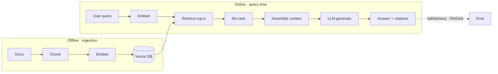

# RAG (Retrieval-Augmented Generation) — Concepts

> Ingest -> embed -> retrieve -> rerank -> generate -> eval

## Diagram (whiteboard version)

> Power move: call out **re-ranking as its own step** — it's what separates a toy RAG from a production one.

## Overview
_Your study notes go here. Explain it like you would to an interviewer._

## Key ideas
- 

## Deep dives
- 

## Common misconceptions
- 
