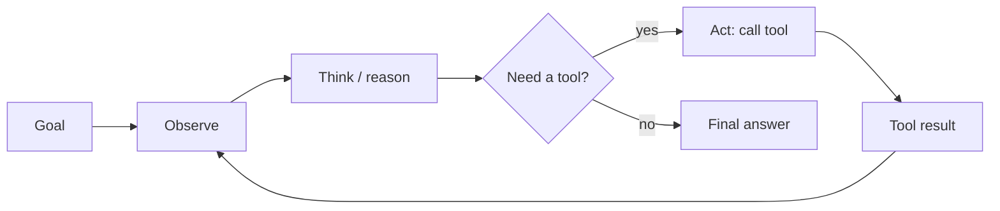

# Agents & Tool Use — Concepts

> LLM-in-a-loop, ReAct, plan-execute, orchestration, error handling

## Diagram (whiteboard version)
The agent loop — **observe → think → act**, repeat until done:

> Guards every loop needs: **max-iteration cap · budget · termination condition** (else it runs forever → see [[22-agent-orchestration]]). ReAct = interleave Reason + Act traces.

## Overview
_Your study notes go here. Explain it like you would to an interviewer._

## Key ideas
- 

## Deep dives
- 

## Common misconceptions
- 
