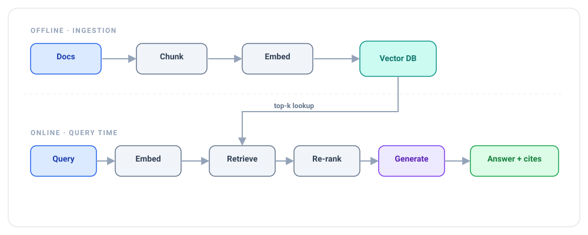
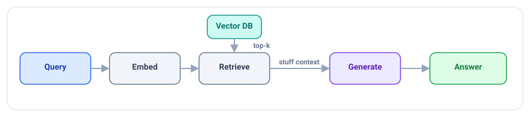
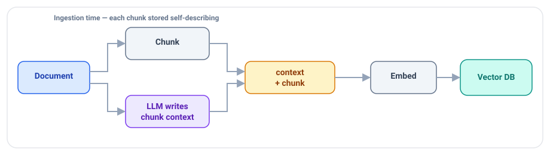
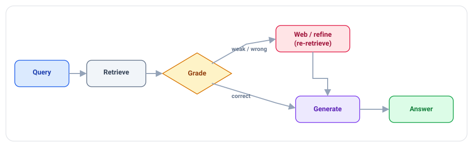
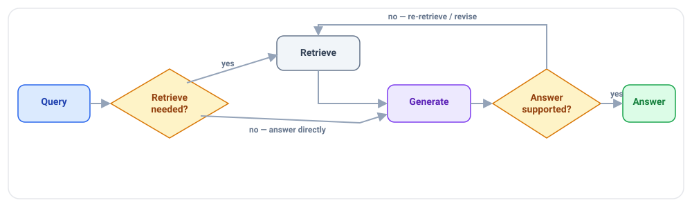
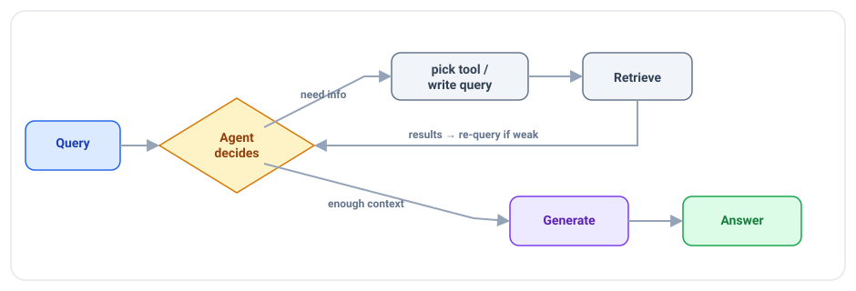
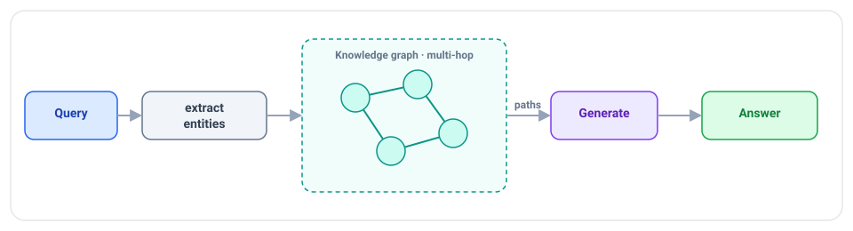

# RAG (Retrieval-Augmented Generation) — Concepts

> Read top-to-bottom the first time. Each idea = **plain definition → everyday analogy → why it matters**.
> Cheatsheet (`cheatsheet.md`) is for revising *after* you understand these.
> Retrieval mechanics live in [[04-embeddings-vector-search]]; measuring quality in [[06-evaluation]].

---

## 1. Why RAG exists (open-book vs closed-book exam)

**Definition:** An LLM only "knows" what it saw in training — its **parametric** knowledge (baked into the weights). **RAG** gives it **non-parametric** knowledge: at query time you *retrieve* relevant documents and paste them into the prompt, so it answers from *your* current data.

**Example — two exams:** a **closed-book** exam = the model answering from memory (can be stale or made-up). An **open-book** exam = you hand it the textbook page first, then ask — it reads and answers from the page. RAG is the open-book setup.

**Why it matters:** It fixes the three big LLM gaps: **stale knowledge** (data changes daily), **private data** (never in training), and **hallucination** (grounds answers in real text). One-liner: *"RAG turns a closed-book model into an open-book one, grounded in fresh, private data."*

---

## 2. RAG vs fine-tuning (give facts vs teach a skill)

**Definition:** **RAG adds knowledge** at query time without changing the model. **Fine-tuning changes behavior/style/format** by adjusting weights — but it does **not** reliably add facts.

**Example:** RAG = handing an employee the latest policy binder to look things up. Fine-tuning = sending them to a training course to change *how* they work (tone, format). You wouldn't run a 2-week course just to tell them today's price — you hand them the sheet (RAG).

**Why it matters:** A constant interview fork. *"Facts and freshness → RAG; consistent style/format or a narrow skill → fine-tune. Try prompting first, RAG second, fine-tune last."* (→ [[24-fine-tuning]])

---

## 3. The pipeline end-to-end

**The six stages:** ingest → chunk → embed/index → retrieve → **re-rank** → generate (+ eval loop). Being able to draw and narrate this is the core skill the interview tests.

---

## 4. Chunking — the techniques menu (cut the book into flashcards)

**Definition:** Documents are split into **chunks** before embedding. Too small → loses context; too large → dilutes relevance and wastes tokens. Typical: **200–500 tokens with ~10–20% overlap**, ideally **structure-aware** (split on headings/paragraphs, not mid-sentence). *How* you split is a real choice — here's the menu:

| Technique | How it splits | Best for |
|---|---|---|
| **Fixed-size** (token/char) | cut every N tokens, add ~10–20% overlap | quick baseline, uniform text |
| **Recursive character** | try separators in order (¶ → line → sentence → word) until under size | general prose — **LangChain default** |
| **Document / layout-aware** | split on Markdown/HTML headings; keep tables & code blocks whole | wikis, docs, code, PDFs |
| **Sentence / sliding-window** | group N sentences; window slides with overlap | dense factual text |
| **Semantic** | embed sentences, cut where adjacent similarity **drops** (topic shift) | mixed-topic documents |
| **Parent-document (small-to-big)** | embed *small* chunks, retrieve them, feed the LLM the larger **parent** | precise match + full context — **this is the answer to "how do you handle large chunks"** |
| **Agentic / propositional** | an LLM picks breakpoints or extracts atomic facts | high-value, messy sources |

**Example:** turning a textbook into **flashcards**. One fact per card = easy to find but may lack context; a whole chapter per card = too much to be useful. Overlap = repeating the last line of one card at the top of the next so a thought split across cards isn't lost. Semantic chunking = cutting a new card whenever the *topic* changes, not every N words.

**Why it matters:** Chunking quality caps retrieval quality — garbage chunks, garbage answers. *"I default to recursive + structure-aware with overlap, and reach for semantic or parent-document chunking when a fixed size splits ideas badly. It's the cheapest lever on RAG quality, and I tune size on my eval set."*

---

## 5. Chunk enrichment / contextual retrieval

**Definition:** Plain chunks lose their context ("it increased 30%" — *what* did?). **Enrichment** adds a short title/summary/surrounding context (or a document-level summary) to each chunk **before** embedding, so it's self-describing.

**Example:** a flashcard that just says *"It grew 30% in Q3"* is useless out of the deck. Add a header — *"[Acme 2024 revenue] It grew 30% in Q3"* — and now it's findable and answerable on its own.

**Why it matters:** Anthropic's "contextual retrieval" showed this cuts retrieval failures substantially. *"I prepend context to each chunk so it's self-contained — big recall win for little cost."* (This is the ingestion trick behind **Context-Augmented RAG**, §11.)

---

## 6. Retrieval — top-k & hybrid search

**Definition:** Embed the query, do ANN similarity search, take the **top-k** chunks. **Hybrid search** combines **vector** (meaning) with **BM25/keyword** (exact terms), then fuses the rankings.

**Example:** vector search is great for *"how do I cancel"* → *"terminate subscription."* But for an exact code like **"ERR_4021"** or a product name, keyword search wins — the meaning-map doesn't help match a rare literal string. Hybrid gets both.

**Why it matters:** *"I use hybrid search because pure vector misses exact terms — names, IDs, error codes — that keyword search nails."* Fusion method: Reciprocal Rank Fusion (RRF) is the common default.

---

## 7. Re-ranking (the step most candidates skip) ⭐

**Definition:** Retrieval is fast but imprecise. A **cross-encoder re-ranker** (Cohere Rerank, BGE-reranker) re-reads each query+chunk pair *together* and re-scores true relevance. You retrieve a wide top-k (say 50) then re-rank down to the best n (say 5).

**Example:** first-round retrieval = skimming titles to grab 50 maybe-relevant books off the shelf. Re-ranking = actually opening each one to check it truly answers the question, then keeping the best 5. Slower per item, so you only do it on the shortlist.

**Why it matters:** *The* power move for this topic. *"Re-ranking is its own step — it's what separates a toy RAG from a production one. Retrieve wide with a cheap vector search, then re-rank narrow with a cross-encoder."*

---

## 8. Generation — grounded + cited

**Definition:** Feed the re-ranked chunks + the query to the LLM with a system prompt: **"answer only from the provided context, cite sources, and say you don't know if it's not there."**

**Example:** an open-book exam with a rule — *"only answer from these pages, and write the page number next to each answer."* If the answer isn't in the pages, write "not covered" instead of guessing.

**Why it matters:** Grounding + citations + an abstain rule are what make RAG **trustworthy** and auditable. *"I force answer-from-context with citations and an 'I don't know' escape hatch to kill hallucination."* (→ [[14-safety-guardrails]])

---

## 9. Types of RAG — the ladder (naive → controlled) ⭐

**Definition:** Every RAG shares *retrieve → generate*. The variants differ by **what control step they add** around it. The TCS JD names five — **Standard, Context-Augmented, Corrective, Agentic, Graph** — so be able to name *and sketch* each.

| Type | What it adds over Standard | Reach for it when |
|---|---|---|
| **Standard / Naive** | nothing — retrieve top-k once → stuff → generate | simple Q&A, baseline |
| **Context-Augmented** | enriches each chunk with doc/section context **before** embedding | chunks lose meaning out of context |
| **Corrective (CRAG)** | **grades** retrieved chunks; falls back (web/re-retrieve) if weak | wrong-doc risk is costly |
| **Self-RAG** | model self-decides *whether* to retrieve + critiques its own answer | cut needless retrieval + hallucination |
| **Agentic** | an agent loops: decides when/what/how-many-times to retrieve | multi-step, ambiguous questions |
| **Graph** | traverses a knowledge graph (entities + relations) | multi-hop relationship questions |

**Example — four students in an open-book exam:** the *naive* one grabs the first page it lands on and writes. A *careful* one checks the page actually answers the question, and hits the library if not (**CRAG**). A *smart* one first asks "do I even need the book for this?" (**Self-RAG**). A *researcher* chases references across several books and cross-links them (**Agentic / Graph**).

**Why it matters:** *"Standard RAG is one retrieve-then-generate pass; the advanced variants add a control step — grade-and-correct, self-reflect, or an agent loop. I pick the simplest one that meets the accuracy bar, because each step adds latency and cost."*

---

## 10. Standard (Naive) RAG

One pass, no grading, no loop. Fast and cheap — the baseline you compare everything else against. Fails quietly when retrieval brings back the wrong chunks (nothing checks them).

---

## 11. Context-Augmented RAG

**Definition:** An *ingestion-time* variant — before embedding, each chunk is prepended with a short LLM-generated description of where it sits in the document (§5). The stored vector now carries its own context, so retrieval finds it even when the raw chunk is ambiguous.

**Why it matters:** *"Context-Augmented RAG is contextual retrieval applied at ingestion — I spend a bit more on indexing so every chunk is self-describing, which lifts recall without touching query-time logic."*

---

## 12. Corrective RAG (CRAG)

**Definition:** Add a **grader** (a lightweight model or the LLM) that scores the retrieved chunks *before* generation. If they're good → generate. If ambiguous or wrong → **correct**: refine the query, pull from a fallback source (web/another index), or re-retrieve, *then* generate.

**Example:** a student who reads the page they pulled, realises it doesn't answer the question, and goes to Google before writing anything — instead of confidently writing from the wrong page.

**Why it matters:** *"CRAG puts a quality gate between retrieval and generation — it grades the context and self-corrects on weak retrieval, so a bad search doesn't become a confident wrong answer."* (Note: grading ≠ re-ranking. Re-ranking *orders* chunks; CRAG *judges whether to trust them at all* and triggers a fallback.)

---

## 13. Self-RAG

**Definition:** The model itself, using **reflection tokens**, decides (1) *whether* retrieval is even needed, and (2) after drafting, whether its answer is actually **supported** by the retrieved text — re-retrieving or revising if not.

**Example:** a student who first asks "do I need the book for this, or do I already know it?" and then double-checks the finished answer against the page before handing it in.

**Why it matters:** *"Self-RAG folds the decision to retrieve and the faithfulness check into the model — it avoids retrieving when it's not needed and catches its own unsupported claims."* Needs a model trained/prompted for the reflection step.

---

## 14. Agentic RAG

**Definition:** Instead of always retrieving once, an **agent decides**: whether to retrieve at all, what query to use, whether to re-query if results are weak, and which source/tool to hit.

**Example:** a smart researcher vs a fixed photocopier. The photocopier always grabs the same page; the researcher reads the question, decides *"I need the 2024 filing, not the 2023 one,"* searches, and if the result is thin, rephrases and searches again.

**Why it matters:** Handles multi-step and ambiguous questions that one-shot RAG botches. *"Agentic RAG lets the model choose when and what to retrieve and re-query on weak results — at the cost of more latency and tokens, so it needs a max-iteration cap."* (→ [[07-agents-tool-use]])

**Agentic RAG vs Agentic AI (name it precisely):** **Agentic AI** is the umbrella — a model in a *plan → act → observe → reflect* loop that pursues a goal and calls tools. **Agentic RAG** is the *retrieval tool inside* that loop — one tool the agent chooses, alongside code, APIs, or SQL. So retrieval isn't dead in the long-context era; naive one-shot RAG is giving way to agentic retrieval, because a 1M-token window still loses to cost (pay per token every call), *lost in the middle*, and corpora too big/private/fresh to ever fit.

*"Agentic RAG is the retrieval module inside an Agentic AI workflow."* The honest trade-off: agentic adds latency, tokens, and non-determinism, so I cap iterations and add a budget guard, and run a **tiered** system — cheap naive RAG for simple lookups, escalate to agentic only for multi-step questions.

---

## 15. Graph RAG

**Definition:** Store knowledge as a **graph** (entities + relationships, e.g. in Neo4j) and retrieve by traversing connections, not just similarity. Good for **multi-hop** questions.

**Example:** *"Which director worked with the actor who starred in the movie that won in 2019?"* — that's a chain of hops between people and films. A graph walks the links; plain vector search struggles to connect them.

**Why it matters:** *"When answers depend on relationships and multi-hop reasoning, I reach for graph RAG; for straight semantic lookup, vector RAG is simpler."*

---

## 16. Tools you'll actually name (with a reason, not a laundry list)

| Layer | Options | Say this |
|---|---|---|
| **Frameworks** | LangChain / LangGraph, LlamaIndex, **Semantic Kernel**, Haystack | *"LangChain/LangGraph for agentic orchestration; LlamaIndex when the app is retrieval-first."* |
| **Vector DBs** | Pinecone, Weaviate, Qdrant, Milvus, Chroma, **pgvector**, FAISS, OpenSearch, **Bedrock Knowledge Bases** | *"pgvector to avoid a new system; Pinecone/Qdrant at scale; Bedrock KB when I'm already on AWS."* (→ [[04-embeddings-vector-search]]) |
| **Parsers / chunkers** | LangChain splitters, LlamaIndex node parsers, Unstructured, LlamaParse | *"Unstructured/LlamaParse for messy PDFs and tables."* |
| **Re-rankers** | Cohere Rerank, BGE-reranker, Jina, Voyage | *"A cross-encoder re-ranker on the shortlist."* (§7) |
| **Evaluation** | RAGAS, TruLens, LangSmith, DeepEval, Arize Phoenix | *"RAGAS for the triad, LangSmith for traces."* (→ [[06-evaluation]]) |

**Why it matters:** Interviewers reward *"I use X because Y,"* not a name-drop. Anchor each choice to a constraint — ops, scale, existing stack, or messiness of the source.

---

## 17. Debugging RAG (isolate retrieval vs generation)

**Definition:** When answers are bad, **split the pipeline**: first check if the right chunks are even in the retrieved set. If **not** → a retrieval problem (chunking, embedding model, k, filters). If they **are** but the answer is still wrong → a generation/prompt problem.

**Example:** a wrong answer in an open-book exam has two causes — you opened the *wrong page* (retrieval), or you had the right page and *misread it* (generation). You fix them very differently, so you diagnose which one first.

**Why it matters:** *The* debugging power move. *"I measure retrieval and generation separately — most 'RAG is bad' complaints are actually retrieval failures."* Fixes: better chunking, hybrid search, add a reranker, raise-then-rerank, query rewriting/HyDE, metadata filters.

---

## 18. Evaluating RAG — the RAG Triad

**Definition:** Three metrics, measured separately (see [[06-evaluation]]):
- **Context relevance** — did retrieval fetch the right chunks?
- **Groundedness / faithfulness** — is the answer supported by those chunks (no hallucination)?
- **Answer relevance** — does it actually address the question?

Plus retrieval metrics: **Precision@k, Recall@k, MRR, nDCG**. Tools: **RAGAS**, LangSmith.

**Why it matters:** *"A RAG system can be faithful but irrelevant, or relevant but ungrounded — so I score all three legs of the triad, not one overall number."*

---

## 19. Corpus size & file limits — do you even need RAG?

**Definition:** Before building RAG, size the corpus. **Small enough → skip RAG** and paste the text straight into a long-context model. **Large → you must retrieve.** And *where* the file-size limit lives depends on whether you use a managed platform or a raw vector DB.

**The page-count decision (rough rule of thumb):**

| Total knowledge base | What to do |
|---|---|
| **≲ 200 pages** | Often **no RAG needed** — inject the whole text into a long-context model's window for near-perfect accuracy. Simpler, no vector store. |
| **~200 → 10,000+ pages** | **Use RAG / Agentic RAG.** Chunk documents into **200–500-word** snippets before embedding, so no single file blows the window (→ §4). |
| **Millions of pages / enterprise** | RAG is the only option — plus metadata filtering, access control, and incremental re-indexing. |

**Where the file-size cap lives:**

| Approach | The limit | What you own |
|---|---|---|
| **Managed LLM platforms** (OpenAI file search / Assistants, Vertex AI, Bedrock KB) | **Hard per-file / per-store caps** — e.g. hundreds of MB per file and multi-million-token stores (*exact numbers change — check current docs*) | Little — they auto-parse, chunk, and embed for you. Convenient, but you **lose control of how files are split**, which can trigger *"lost in the middle"* on long PDFs. |
| **Raw vector DBs** (Pinecone, Milvus, Qdrant, Chroma, pgvector) | **No file-size limit** — the DB only stores vectors, not files | Everything — *you* write the parse → chunk → embed pipeline. Full control of chunking; more infra work. |

**Why it matters:** *"First I ask whether the corpus even needs RAG — under a couple hundred pages I just use long context. Above that I chunk to 200–500 words and retrieve. On managed platforms the file caps are fixed and chunking is automatic, so I trade control for convenience; with a raw vector DB there's no file limit but I own the whole ingestion pipeline."* This is the honest counterpart to the long-context debate in [interview-qa.md](interview-qa.md) Q7.

---

## Quick misconceptions to avoid
- ❌ "RAG teaches the model new facts permanently." → No — it injects facts *at query time*; the weights don't change.
- ❌ "Fine-tuning is how you add knowledge." → Fine-tuning changes style/format; use **RAG** for facts.
- ❌ "Just retrieve top-k and generate." → Skipping **re-ranking** is the #1 quality miss.
- ❌ "Pure vector search is enough." → It misses exact terms/IDs — use **hybrid**.
- ❌ "Bad answers mean the LLM is bad." → Usually it's **retrieval** — measure the stages separately.
- ❌ "Bigger context = just stuff all chunks in." → Costs more, and 'lost in the middle' hurts; retrieve *precisely* (or use parent-document chunking).
- ❌ "More advanced RAG type = better." → Each variant adds latency/cost; pick the **simplest** that hits the accuracy bar.
- ❌ "CRAG is just re-ranking." → Re-ranking *orders* chunks; **CRAG grades whether to trust them** and triggers a fallback.

---
_Related: [[04-embeddings-vector-search]] · [[06-evaluation]] · [[09-context-engineering]] · [[07-agents-tool-use]] · [[24-fine-tuning]] · [[14-safety-guardrails]]_
