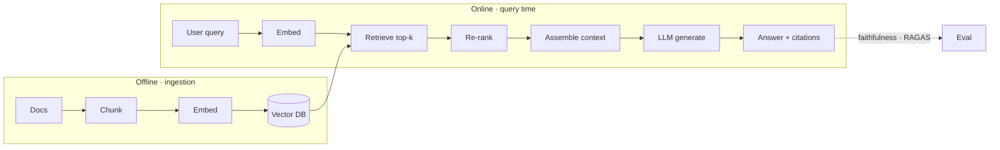

# RAG (Retrieval-Augmented Generation) — Concepts

> Read top-to-bottom the first time. Each idea = **plain definition → everyday analogy → why it matters**.
> Cheatsheet (`cheatsheet.md`) is for revising *after* you understand these.
> Retrieval mechanics live in [[04-embeddings-vector-search]]; measuring quality in [[06-evaluation]].

---

## 1. Why RAG exists (open-book vs closed-book exam)

**Definition:** An LLM only "knows" what it saw in training — its **parametric** knowledge (baked into the weights). **RAG** gives it **non-parametric** knowledge: at query time you *retrieve* relevant documents and paste them into the prompt, so it answers from *your* current data.

**Example — two exams:** a **closed-book** exam = the model answering from memory (can be stale or made-up). An **open-book** exam = you hand it the textbook page first, then ask — it reads and answers from the page. RAG is the open-book setup.

**Why it matters:** It fixes the three big LLM gaps: **stale knowledge** (data changes daily), **private data** (never in training), and **hallucination** (grounds answers in real text). One-liner: *"RAG turns a closed-book model into an open-book one, grounded in fresh, private data."*

---

## 2. RAG vs fine-tuning (give facts vs teach a skill)

**Definition:** **RAG adds knowledge** at query time without changing the model. **Fine-tuning changes behavior/style/format** by adjusting weights — but it does **not** reliably add facts.

**Example:** RAG = handing an employee the latest policy binder to look things up. Fine-tuning = sending them to a training course to change *how* they work (tone, format). You wouldn't run a 2-week course just to tell them today's price — you hand them the sheet (RAG).

**Why it matters:** A constant interview fork. *"Facts and freshness → RAG; consistent style/format or a narrow skill → fine-tune. Try prompting first, RAG second, fine-tune last."* (→ [[24-fine-tuning]])

---

## 3. The pipeline end-to-end

**The six stages:** ingest → chunk → embed/index → retrieve → **re-rank** → generate (+ eval loop). Being able to draw and narrate this is the core skill the interview tests.

---

## 4. Chunking (cut the book into flashcards)

**Definition:** Documents are split into **chunks** before embedding. Too small → loses context; too large → dilutes relevance and wastes tokens. Typical: **200–500 tokens with ~10–20% overlap**, ideally **structure-aware** (split on headings/paragraphs, not mid-sentence).

**Example:** turning a textbook into **flashcards**. One fact per card = easy to find but may lack context; a whole chapter per card = too much to be useful. Overlap = repeating the last line of one card at the top of the next so a thought split across cards isn't lost.

**Why it matters:** Chunking quality caps retrieval quality — garbage chunks, garbage answers. *"I chunk structure-aware with overlap and tune size on my eval set — it's the cheapest lever on RAG quality."*

---

## 5. Chunk enrichment / contextual retrieval

**Definition:** Plain chunks lose their context ("it increased 30%" — *what* did?). **Enrichment** adds a short title/summary/surrounding context (or a document-level summary) to each chunk **before** embedding, so it's self-describing.

**Example:** a flashcard that just says *"It grew 30% in Q3"* is useless out of the deck. Add a header — *"[Acme 2024 revenue] It grew 30% in Q3"* — and now it's findable and answerable on its own.

**Why it matters:** Anthropic's "contextual retrieval" showed this cuts retrieval failures substantially. *"I prepend context to each chunk so it's self-contained — big recall win for little cost."*

---

## 6. Retrieval — top-k & hybrid search

**Definition:** Embed the query, do ANN similarity search, take the **top-k** chunks. **Hybrid search** combines **vector** (meaning) with **BM25/keyword** (exact terms), then fuses the rankings.

**Example:** vector search is great for *"how do I cancel"* → *"terminate subscription."* But for an exact code like **"ERR_4021"** or a product name, keyword search wins — the meaning-map doesn't help match a rare literal string. Hybrid gets both.

**Why it matters:** *"I use hybrid search because pure vector misses exact terms — names, IDs, error codes — that keyword search nails."* Fusion method: Reciprocal Rank Fusion (RRF) is the common default.

---

## 7. Re-ranking (the step most candidates skip) ⭐

**Definition:** Retrieval is fast but imprecise. A **cross-encoder re-ranker** (Cohere Rerank, BGE-reranker) re-reads each query+chunk pair *together* and re-scores true relevance. You retrieve a wide top-k (say 50) then re-rank down to the best n (say 5).

**Example:** first-round retrieval = skimming titles to grab 50 maybe-relevant books off the shelf. Re-ranking = actually opening each one to check it truly answers the question, then keeping the best 5. Slower per item, so you only do it on the shortlist.

**Why it matters:** *The* power move for this topic. *"Re-ranking is its own step — it's what separates a toy RAG from a production one. Retrieve wide with a cheap vector search, then re-rank narrow with a cross-encoder."*

---

## 8. Generation — grounded + cited

**Definition:** Feed the re-ranked chunks + the query to the LLM with a system prompt: **"answer only from the provided context, cite sources, and say you don't know if it's not there."**

**Example:** an open-book exam with a rule — *"only answer from these pages, and write the page number next to each answer."* If the answer isn't in the pages, write "not covered" instead of guessing.

**Why it matters:** Grounding + citations + an abstain rule are what make RAG **trustworthy** and auditable. *"I force answer-from-context with citations and an 'I don't know' escape hatch to kill hallucination."* (→ [[14-safety-guardrails]])

---

## 9. Agentic RAG

**Definition:** Instead of always retrieving once, an **agent decides**: whether to retrieve at all, what query to use, whether to re-query if results are weak, and which source/tool to hit.

**Example:** a smart researcher vs a fixed photocopier. The photocopier always grabs the same page; the researcher reads the question, decides *"I need the 2024 filing, not the 2023 one,"* searches, and if the result is thin, rephrases and searches again.

**Why it matters:** Handles multi-step and ambiguous questions that one-shot RAG botches. *"Agentic RAG lets the model choose when and what to retrieve and re-query on weak results — at the cost of more latency and tokens."* (→ [[07-agents-tool-use]])

---

## 10. Graph RAG

**Definition:** Store knowledge as a **graph** (entities + relationships, e.g. in Neo4j) and retrieve by traversing connections, not just similarity. Good for **multi-hop** questions.

**Example:** *"Which director worked with the actor who starred in the movie that won in 2019?"* — that's a chain of hops between people and films. A graph walks the links; plain vector search struggles to connect them.

**Why it matters:** *"When answers depend on relationships and multi-hop reasoning, I reach for graph RAG; for straight semantic lookup, vector RAG is simpler."*

---

## 11. Debugging RAG (isolate retrieval vs generation)

**Definition:** When answers are bad, **split the pipeline**: first check if the right chunks are even in the retrieved set. If **not** → a retrieval problem (chunking, embedding model, k, filters). If they **are** but the answer is still wrong → a generation/prompt problem.

**Example:** a wrong answer in an open-book exam has two causes — you opened the *wrong page* (retrieval), or you had the right page and *misread it* (generation). You fix them very differently, so you diagnose which one first.

**Why it matters:** *The* debugging power move. *"I measure retrieval and generation separately — most 'RAG is bad' complaints are actually retrieval failures."* Fixes: better chunking, hybrid search, add a reranker, raise-then-rerank, query rewriting/HyDE, metadata filters.

---

## 12. Evaluating RAG — the RAG Triad

**Definition:** Three metrics, measured separately (see [[06-evaluation]]):
- **Context relevance** — did retrieval fetch the right chunks?
- **Groundedness / faithfulness** — is the answer supported by those chunks (no hallucination)?
- **Answer relevance** — does it actually address the question?

Plus retrieval metrics: **Precision@k, Recall@k, MRR, nDCG**. Tools: **RAGAS**, LangSmith.

**Why it matters:** *"A RAG system can be faithful but irrelevant, or relevant but ungrounded — so I score all three legs of the triad, not one overall number."*

---

## Quick misconceptions to avoid
- ❌ "RAG teaches the model new facts permanently." → No — it injects facts *at query time*; the weights don't change.
- ❌ "Fine-tuning is how you add knowledge." → Fine-tuning changes style/format; use **RAG** for facts.
- ❌ "Just retrieve top-k and generate." → Skipping **re-ranking** is the #1 quality miss.
- ❌ "Pure vector search is enough." → It misses exact terms/IDs — use **hybrid**.
- ❌ "Bad answers mean the LLM is bad." → Usually it's **retrieval** — measure the stages separately.
- ❌ "Bigger context = just stuff all chunks in." → Costs more, and 'lost in the middle' hurts; retrieve *precisely*.

---
_Related: [[04-embeddings-vector-search]] · [[06-evaluation]] · [[09-context-engineering]] · [[07-agents-tool-use]] · [[24-fine-tuning]] · [[14-safety-guardrails]]_
