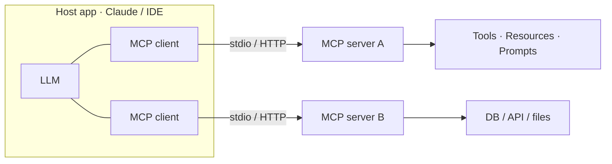

# MCP & Custom Agent Skills — Concepts

> Model Context Protocol servers + custom agent skills (your edge)

## Diagram (whiteboard version)

> One-liner: **MCP is USB-C for LLM tools** — a standard so any client can talk to any server. Servers expose three primitives: **tools** (actions), **resources** (data), **prompts** (templates). MCP = agent↔tools; A2A = agent↔agent.

## Overview
_Your study notes go here. Explain it like you would to an interviewer._

## Key ideas
- 

## Deep dives
- 

## Common misconceptions
- 
