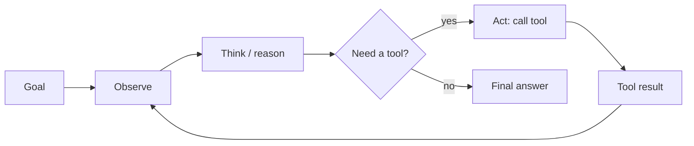

# Agents & Tool Use — Concepts

> Read top-to-bottom the first time. Each idea = **plain definition → everyday analogy → why it matters**.
> Cheatsheet (`cheatsheet.md`) is for revising *after* you understand these.
> This is a **headline topic** on your resume — expect the deepest probing here. Orchestration overlaps with [[12-agent-orchestration]]; extensibility with [[08-mcp-custom-skills]].

---

## 1. What an agent actually is (an LLM in a loop)

**Definition:** An **agent** is an LLM put in a loop with **tools** and a **goal**. Each turn it looks at the current state, decides the next action (call a tool or answer), does it, reads the result, and repeats until the goal is met.

**Example — a new intern with a phone and a to-do list:** you give them a goal ("book the cheapest flight"). They think, pick up the phone (a tool), get a quote (result), think again, call another airline, and stop once they've booked. The LLM is the intern; tools are the phone/websites; the loop is them working until done.

**Why it matters:** The one-liner that frames the whole topic: *"An agent is just an LLM in a loop with tools — the magic is the loop and the tools, not a special model."* Everything else (patterns, guardrails) is about making that loop reliable.

---

## 2. Chat vs. agent (talking vs. doing)

**Definition:** A plain chatbot **generates text**. An agent **takes actions** in the world — it searches, queries a DB, writes a file, calls an API — and uses the results to decide what to do next.

**Example:** a consultant who only gives advice vs. one who actually makes the calls, files the paperwork, and books the room. Same knowledge, very different value — and very different risk.

**Why it matters:** The jump from "generates an answer" to "does the task" is *the* applied-AI trend. It's also where danger enters — a wrong sentence is harmless; a wrong `DELETE` is not (→ §8).

---

## 3. Tools = the agent's hands (and the schema is the manual)

**Definition:** A **tool** is a function the agent can call — described to the model with a **name, a description, and a JSON schema** of its arguments. The model reads those descriptions to decide *which* tool and *what* arguments. **The tool description is the interface.**

**Example:** tools are labeled buttons on a machine. A button labeled *"Start"* with no explanation gets pressed randomly; a button labeled *"Start wash — takes 40 min, don't use on wool"* gets used correctly. The label (description) does the teaching, not the wiring.

**Why it matters:** Most "the agent is dumb" problems are actually bad tool descriptions. *"I treat tool descriptions like API docs — clear name, when-to-use, argument meanings, and helpful error messages — because that text is what the model reasons over."*

---

## 4. Tool design principles (granularity & error messages)

**Definition:** Good tools are **right-sized** (not one god-tool with 20 args, not 50 micro-tools), have **unambiguous names**, and return **helpful, actionable errors** the model can recover from.

**Example:** a good kitchen has a *knife*, a *pan*, a *whisk* — distinct, obvious jobs. One "cooking device" with a 30-setting dial is unusable; 200 single-purpose gadgets are overwhelming. And when something's wrong, "add more flour, batter too thin" beats "Error 500."

**Why it matters:** Tool ergonomics drive reliability far more than model choice. *"When a tool errors, I return a message that tells the model how to fix the call — that turns a dead end into a self-correction."*

---

## 5. ReAct — reason then act, in a loop

**Definition:** **ReAct** (Reason + Act) interleaves a **thought** ("I need the user's order date") with an **action** (call the orders tool) and an **observation** (the result), repeating. The visible reasoning trace steers the next action.

**Example:** a detective thinking out loud — *"the window was locked, so they came through the door → check the door for prints"* → checks → *"prints match the butler → ..."*. Each thought decides the next move based on the last clue.

**Why it matters:** It's the default open-ended pattern and what most frameworks implement. *"ReAct for adaptive, open-ended tasks where I can't pre-plan the steps."*

---

## 6. Orchestration patterns (match the pattern to the task)

**Definition:** Common shapes for how the loop is structured:
- **ReAct** — adaptive, step-by-step; decide as you go.
- **Plan-then-Execute** — plan all steps up front, then run them (optionally re-plan). Fewer wandering loops.
- **Map-Reduce** — fan out independent subtasks in parallel, then combine.
- **Multi-agent** — specialized agents coordinated by an orchestrator (→ [[12-agent-orchestration]]).

**Example:** planning a trip. **Plan-execute** = write the full itinerary, then book each item. **ReAct** = decide the next stop only after seeing how the last one went. **Map-reduce** = three friends each research flights/hotels/food at once, then merge notes.

**Why it matters:** *"I match the pattern to task complexity — plan-execute for known multi-step workflows, ReAct for open-ended ones, map-reduce for parallel subtasks."*

---

## 7. Chain vs. agent vs. workflow (determinism is a feature)

**Definition:** A **chain/workflow** is a *predefined* sequence — **you** decide the path (deterministic). An **agent** lets the **LLM** decide the path at runtime (which tool, when to stop). Agents are flexible but less predictable and harder to debug.

**Example:** a **recipe** (workflow — same steps every time) vs. a **chef improvising** with what's in the fridge (agent). For a burger line you want the recipe; for "cook something with these random ingredients" you want the chef.

**Why it matters:** *The* maturity signal for this topic. *"I reach for the least-agentic thing that works — determinism is a feature in production. Give the LLM agency only where the path genuinely can't be known ahead of time."*

---

## 8. Guardrails — because tools have real consequences

**Definition:** An agent with real tool access is dangerous, so you constrain it:
- **Permissions / least privilege** — only the tools it truly needs.
- **Human-in-the-loop (HITL)** — approval gate before high-stakes actions (send money, delete, email a customer).
- **Sandboxing** — run code/actions in an isolated environment.
- **Input & output validation** — check arguments *before* the call executes.

**Example:** a new employee gets a **badge that opens only their floor**, needs a manager's sign-off for expenses over $500, and tests changes on a staging copy — not the live system. Same trust model for agents.

**Why it matters:** *"I give the agent least privilege, gate irreversible actions behind human approval, and sandbox execution — the blast radius of a wrong action, not a wrong sentence, is what I design around."* (→ [[14-safety-guardrails]])

---

## 9. Error handling & stopping (don't loop forever)

**Definition:** Tools fail, APIs time out, models pick wrong. Robust agents have **retries with backoff**, **fallbacks / graceful degradation**, **idempotent tools** (safe to retry), and hard **stop conditions**: max-iteration cap, token/cost budget, and a clear termination check.

**Example:** a GPS that reroutes when a road is closed (fallback), retries a lost signal (retry), but also gives up and says "can't find a route" instead of driving you in circles forever (max iterations).

**Why it matters:** Runaway loops burn money and time. *"Every loop has a max-iteration cap and a budget — an agent without a stop condition is an outage waiting to happen."* (→ [[15-cost-optimization]])

---

## 10. Computer use & app SDKs (eyes and a mouse)

**Definition:** Beyond APIs, agents can drive a **browser or GUI** — reading the screen and clicking/typing — to operate software that has no API.

**Example:** instead of a phone line to the airline (API), the intern sits at a laptop and actually clicks through the booking site like a person. Slower and more fragile, but works when there's no back door.

**Why it matters:** Expands what agents can automate, but it's brittle and slow. *"Computer use is my fallback when there's no API — powerful for legacy systems, but I prefer a real tool/API when one exists."*

---

## 11. Evaluating & tracing agents

**Definition:** Because the path is dynamic, you **trace every step** (thought → tool → args → result) and measure **task success rate**, **tool-selection accuracy**, **number of steps**, and **cost per task**. Replay failing traces; add per-tool unit evals.

**Example:** a black-box recorder on a plane — when something goes wrong you don't guess, you replay the exact sequence of decisions to see where it went off course.

**Why it matters:** *"I can't debug an agent I can't see, so I trace the full decision path and score success rate, steps, and cost — most failures are wrong-tool, malformed-args, or ignoring a tool error."* (→ [[06-evaluation]], [[16-monitoring-and-debugging]])

---

## 12. MCP & skills — how agents get extensible (your edge)

**Definition:** **MCP (Model Context Protocol)** standardizes how an agent connects to external tools/data via servers, decoupling tool implementations from the agent. **Custom skills** package reusable instructions the agent loads on demand.

**Example:** MCP is a **USB-C port for tools** — any compliant tool plugs into any compliant agent without custom wiring. Skills are **playbooks** the agent pulls off the shelf when a task matches.

**Why it matters:** They make agents extensible without retraining — a differentiator worth owning. *"MCP standardizes tool connections; skills package reusable know-how — together they let me extend an agent without touching the model."* (→ [[08-mcp-custom-skills]])

---

## Quick misconceptions to avoid
- ❌ "An agent needs a special model." → It's any capable LLM **in a loop with tools**.
- ❌ "More agency is always better." → Prefer the **least-agentic** design that works; determinism is a feature.
- ❌ "The model is dumb at picking tools." → Usually it's **bad tool descriptions/schemas** — fix the docs.
- ❌ "Just let it run until it's done." → No stop condition = infinite loops and runaway cost; **always cap** iterations/budget.
- ❌ "Guardrails are a launch-day add-on." → Permissions, HITL, and sandboxing are **design-time** — a wrong action isn't a wrong sentence.
- ❌ "Agents are impossible to debug." → **Trace every step** and replay; the path is recoverable.

---
_Related: [[12-agent-orchestration]] · [[08-mcp-custom-skills]] · [[11-langchain-langgraph]] · [[14-safety-guardrails]] · [[06-evaluation]] · [[16-monitoring-and-debugging]] · [[09-context-engineering]]_
