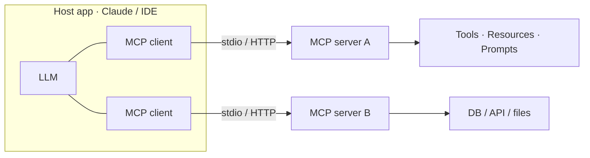

# MCP & Custom Agent Skills — Concepts

> Read top-to-bottom the first time. Each idea = **plain definition → everyday analogy → why it matters**.
> Cheatsheet (`cheatsheet.md`) is for revising *after* you understand these.
> **This is your differentiator** — few candidates can go deep here. Builds on agents ([[07-agents-tool-use]]); contrast with agent-to-agent ([[13-a2a-agent-to-agent]]).

---

## 1. The problem MCP solves (N×M bespoke wiring)

**Definition:** Before **MCP**, every agent-to-tool connection was custom code: each app wired each tool its own way. With *N* apps and *M* tools that's *N×M* one-off integrations to build and maintain.

**Example — chargers before USB-C:** every phone had its own plug, so every household had a drawer of incompatible cables. USB-C made one standard connector work everywhere. MCP does that for LLM tools.

**Why it matters:** The framing that lands the whole topic. *"Before MCP, every agent-to-tool integration was bespoke — MCP makes tools portable. I build a server once and reuse it across any compatible client."*

---

## 2. What MCP is (a standard protocol)

**Definition:** **MCP (Model Context Protocol)** is an open protocol that standardizes how AI apps connect to external tools, data, and context. An **MCP server** exposes capabilities over a standard interface; any MCP-compatible **client** (agent, IDE, chat app) can use them with no custom glue.

**Example:** a **universal power adapter** for travel — the wall socket (client) and your device (tool) don't need to know each other's shape; the adapter (protocol) makes any-to-any work.

**Why it matters:** It **decouples tool implementations from the agent**, so capabilities are reusable across apps and you don't rebuild integrations per framework. *"MCP is USB-C for LLM tools."*

---

## 3. The three server primitives (tools, resources, prompts)

**Definition:** An MCP server exposes three kinds of things:
- **Tools** — *actions* the model can invoke (send email, run a query).
- **Resources** — *data/context* the model can read (files, DB rows, docs).
- **Prompts** — *reusable templates* a user or client can trigger.

**Example — a workshop:** **tools** are the power tools you operate, **resources** are the reference manuals on the shelf, **prompts** are the pre-written job cards ("how to service a bike"). Same workshop, three kinds of help.

**Why it matters:** Knowing the exact surface signals hands-on depth. *"A server exposes tools for actions, resources for data, and prompts for reusable templates — that's the whole contract."*

---

## 4. Client–server model & transports (stdio / HTTP)

**Definition:** MCP is **client–server**. The **host app** runs an MCP **client** per server; the **server** runs the actual tool/data logic. They talk over a **transport**: **stdio** (local subprocess — fast, private) or **HTTP** (remote/networked).

**Example:** stdio = talking to a colleague **in the same room** (a local process on your machine). HTTP = **phoning** a colleague in another building (a remote server). Same conversation, different distance.

**Why it matters:** *"stdio for local servers I run alongside the app, HTTP for remote/shared ones — the protocol is the same, only the transport changes."* Local stdio keeps sensitive data on-machine.

---

## 5. Using existing servers vs. building your own

**Definition:** You can **consume** ready-made servers (filesystem, GitHub, Slack, Postgres, etc.) or **build** one to expose *your* systems — define the tools/resources/prompts, handle auth, and any client can use it.

**Example:** you can buy standard USB-C peripherals off the shelf (existing servers), or manufacture your own device with a USB-C port so it works with everyone's laptops (your server).

**Why it matters:** The build story is the memorable part. *"I reuse community servers for common systems and build my own to expose our internal APIs once, so every client gets them for free."*

---

## 6. What a custom skill is (loadable know-how)

**Definition:** A **skill** is a packaged, reusable set of *instructions/capabilities* — typically a `SKILL.md` with a name, a description, and a body — that an agent **loads on demand** when a task matches. It extends behavior without retraining or bloating the base prompt.

**Example:** a chef's **recipe cards** in a box. The chef doesn't memorize 500 recipes (bloated prompt); they grab the *one* card when the order calls for it. The card's title (description) is how they know which to pull.

**Why it matters:** *"Skills let me encode a repeatable workflow once and have the agent invoke it just-in-time — capability without context bloat."* The **description is the trigger**, so it must be crisp (→ [[09-context-engineering]]).

---

## 7. Skill vs. tool (know-how vs. a callable)

**Definition:** A **tool** is a single callable function/API (one action). A **skill** is *procedural know-how* — "how to do X here" — that may **orchestrate several tools** and inject instructions.

**Example:** a **drill** is a tool (one action). *"How to mount a shelf level"* is a skill — it tells you to use the drill, the level, and the stud-finder in the right order. The skill choreographs the tools.

**Why it matters:** A crisp distinction interviewers love. *"A tool is a verb the model can call; a skill is a playbook that may call several tools and carry instructions on how to use them."*

---

## 8. Skill vs. fine-tune vs. long system prompt (the trade-off)

**Definition:** Four ways to give an agent a capability:
- **Long system prompt** — always loaded → burns context every call, even when irrelevant.
- **Fine-tune** — bakes behavior into weights → powerful but costly, slow to change, needs data.
- **Tool** — an action, but not the *procedure* for using it well.
- **Skill** — loaded **only when relevant** → capability without permanent context cost, editable in minutes.

**Example:** teaching an employee. **Fine-tune** = send them to a multi-week course (permanent, expensive). **Long prompt** = tape a huge instruction sheet to their monitor forever (always in the way). **Skill** = a binder they open only for the task at hand. For a workflow that changes monthly, the binder wins.

**Why it matters:** *"I try prompt first, then a skill for reusable procedures, and fine-tune only when I need the behavior baked in — skills give me most of the benefit with none of the retraining cost."*

---

## 9. Security of granting agents MCP tools

**Definition:** An MCP tool is real access, so the risks are the same as any tool access — plus a supply-chain angle: a **third-party server** you didn't write runs code and sees your data. Controls: **least privilege**, **sandboxing**, **input/output validation**, **human-in-the-loop** for high-stakes actions, and **vetting/trusting** the servers you connect. Watch for **prompt injection** via resources a server returns.

**Example:** plugging a **USB stick from a stranger** into your work laptop. The port being standard (MCP) doesn't make the device safe — you still scan it, limit what it can touch, and don't run it as admin.

**Why it matters:** Shows maturity beyond the hype. *"A standard connector doesn't mean a trusted tool — I vet servers, grant least privilege, sandbox execution, and treat resource content as untrusted input that could carry injection."* (→ [[14-safety-guardrails]])

---

## 10. MCP vs. A2A (agent↔tools vs. agent↔agent)

**Definition:** **MCP** connects an agent to **tools/data** (vertical: model reaching down to capabilities). **A2A** (Agent-to-Agent) connects **agents to each other** (horizontal: peers delegating). Different layers, often used together.

**Example:** MCP is an employee using the **company tools** (email, database). A2A is that employee **delegating to a coworker**. One reaches for a tool; the other hands off to a peer.

**Why it matters:** A clean boundary that prevents a common mix-up. *"MCP is agent-to-tools; A2A is agent-to-agent — I use MCP to give one agent capabilities and A2A to let agents collaborate."* (→ [[13-a2a-agent-to-agent]])

---

## 11. Host, Client, Server — the three roles

**Definition:** MCP has three components. The **Host** is the app the user actually talks to (ChatGPT, Claude Desktop, an IDE) — the front door where prompts come in. The **Client** lives inside the host and acts as a **translator**: one client per server, it carries the host's request to a server and the server's response back. The **Server** exposes the tools, resources, and prompts of an application — a *Gmail server* offers read/search/send; a *database server* offers run-query/fetch-records.

**Example — a restaurant:** the **Host** is the dining room where you sit and order; the **Client** is the waiter who carries your order to the kitchen and brings the dish back; the **Server** is the kitchen that actually does the work. You never talk to the kitchen directly — the waiter (client) translates both ways.

**Why it matters:** *"Host is the UI, client is the per-server translator, server exposes the actual capabilities."* The key advantage to name: **the model needs no hardcoded knowledge of a tool — it discovers what a server can do at run-time.**

---

## 12. The request lifecycle (plan → discover → schema → auth → execute) ⭐

**Definition:** When a prompt needs the outside world, the agent runs five steps:
1. **Planning** — it recognizes the task needs external data or an action.
2. **Discovery** — it finds which MCP servers are connected and what they offer.
3. **Schema understanding** — it reads the tool's **contract** (parameters, input types) **at run-time** — no prior hardcoding.
4. **Authentication** — the system verifies identity and permissions, often via **OAuth**, before access.
5. **Execution & reasoning** — it calls the tool through the server, gets the data, reasons over it, and answers.

**Example — a new employee handed a task:** they check what systems exist (discovery), read the form's required fields (schema), badge in (auth), then actually do the job and report back (execute).

**Why it matters:** Run-time schema discovery is the differentiator. *"The model learns each tool's contract at run-time, so I can add, change, or remove a tool by editing its server — the agent adapts without any code change."*

---

## 13. Why enterprises adopt MCP (scale · RBAC · audit · graceful failure)

**Definition:** Four properties make MCP enterprise-grade:
- **Scalability** — change an app and you update only *its* server, not every AI assistant.
- **Security** — **RBAC** (role-based access control) so a user only reaches data they're authorized to see.
- **Traceability** — **audit logs** of what the agent did and why, for compliance and debugging.
- **Graceful failure** — if one server (say Slack) is down, the agent reports *that specific* failure instead of crashing the whole task.

**Example:** a big company with one badge system for every building. Add a new office → register one door reader (server); you don't re-issue everyone's badge. Access is scoped per role, every swipe is logged, and a broken reader just denies that door — the building still runs.

**Why it matters:** *"MCP isn't just convenience — it gives enterprises scalable maintenance, RBAC, audit logs, and graceful degradation, which is what makes it safe to put an agent in front of real systems."* (→ [[14-safety-guardrails]] · [[16-monitoring-and-debugging]])

---

## 14. The three pillars: LLM + RAG + MCP

**Definition:** The strongest enterprise AI systems combine three layers: **LLM** for *reasoning*, **RAG** for *knowledge* (retrieve the right facts, → [[05-rag]]), and **MCP** for *action* (reach and change real systems). Reasoning alone is isolated; add knowledge and it's grounded; add action and it can actually *do* things.

**Example — a capable employee:** the **brain** that reasons (LLM), the **reference library** they look things up in (RAG), and the **hands plus building access** to get work done (MCP). Remove any one and they're stuck: no brain can't think, no library guesses, no hands can only talk.

**Why it matters:** The one-liner that ties the whole curriculum together. *"LLM thinks, RAG knows, MCP acts — real enterprise AI needs all three."*

---

## Quick misconceptions to avoid
- ❌ "MCP is a model or a framework." → It's an **open protocol** (a standard), not a model or library.
- ❌ "A skill is just a tool." → A tool is one callable; a **skill is procedural know-how** that may orchestrate tools.
- ❌ "Put every capability in the system prompt." → That bloats context; **skills load on demand**.
- ❌ "A standard connector means it's safe." → Vet servers, least-privilege, sandbox — resource content can carry **injection**.
- ❌ "MCP and A2A are the same." → MCP = agent↔**tools**; A2A = agent↔**agents**.
- ❌ "You must build a server from scratch." → Reuse community servers; build your own only to expose *your* systems.
- ❌ "The agent needs the tool's API hardcoded." → No — it **discovers** servers and learns the tool **schema at run-time**.
- ❌ "MCP replaces RAG." → Different pillars: **RAG = knowledge, MCP = action** — enterprise systems use both plus the LLM.

---
_Related: [[07-agents-tool-use]] · [[13-a2a-agent-to-agent]] · [[09-context-engineering]] · [[14-safety-guardrails]] · [[11-langchain-langgraph]] · [[24-fine-tuning]]_
