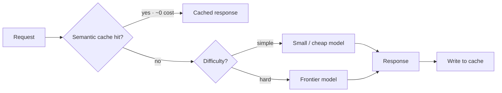

# Cost Optimization — Concepts

> Model routing, caching, batching, prompt + output token control

## Diagram (whiteboard version)

> Levers, quantified: **routing** (cheap vs frontier), **semantic caching** (~0 on hits), **prompt caching** (~90% off cached reads), **batch API** (~50% off), trim **output tokens** (4–5× input price). Power move: quantify — "routing cut cost 70% at 95% quality."

## Overview
_Your study notes go here. Explain it like you would to an interviewer._

## Key ideas
- 

## Deep dives
- 

## Common misconceptions
- 
