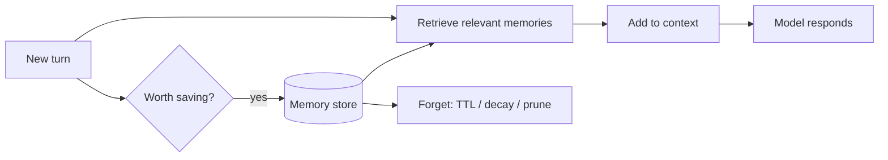

# Memory Systems — Concepts (learn-first)

> Read top to bottom once. Each concept: plain definition → a real-world example → why it matters in an interview.
> This is the sibling of [[09-context-engineering]] — context engineering decides what's *in the window now*; memory decides what's *kept for later*.

---

## 1. What "memory" actually means for an agent

**Definition.** Memory is any information an agent can use that is **not already in the current context window**. The window is what it can "see" right now; memory is everything it can go *fetch*.

**Real-world example.** Think of a good hotel concierge. During your conversation they hold everything in their head (that's the context window). But when you check in *next year*, they pull up your file: "Welcome back — you liked the quiet room away from the elevator." That file is long-term memory. The head-holding is short-term; the file is long-term.

**Why it matters.** The rookie answer to "the bot forgets things" is "increase the context window." The senior answer is "most of that shouldn't be in the window at all — it should be in a store I retrieve from." Say that.

---

## 2. Short-term vs long-term memory

**Definition.**
- **Short-term** = lives *inside* the context window (the current conversation). Vanishes when the session ends or gets trimmed.
- **Long-term** = lives in an *external store* (database, vector store, file). Survives across sessions.

**Real-world example.** Short-term is the sticky note on your desk for today's calls. Long-term is the contacts app on your phone — still there next month.

**Why it matters.** Interviewers want the boundary. "Anything I need *this turn* goes in the window; anything I need *next week* goes in a store." Clean line.

---

## 3. The three memory types (episodic / semantic / procedural)

**Definition.** Borrowed from how humans remember:
- **Episodic** — specific events. *"On July 3rd the user asked me to cancel the Mumbai order."*
- **Semantic** — general facts. *"The user's name is Prasad; they prefer metric units."*
- **Procedural** — how to do things / learned skills. *"To refund, call the `refund` tool then confirm."*

**Real-world example.** Episodic = your diary. Semantic = the facts you just *know* (your friend is vegetarian). Procedural = riding a bike — you don't recite steps, you just do it.

**Why it matters.** Naming these three shows you've thought past "just save the chat." Most production memory is semantic (user facts) + episodic (past interactions).

---

## 4. Session memory vs user (cross-session) memory

**Definition.**
- **Session memory** — scoped to one conversation. Ends with the session.
- **User / cross-session memory** — tied to the *user*, carried into every future session.

**Real-world example.** Session memory is a single phone call with support. User memory is the account notes the next agent reads before calling you back: "already tried restarting."

**Why it matters.** "Your chatbot forgets between sessions" is a classic question. The fix is a **user-keyed store** you load at the start of each session — not a bigger window.

---

## 5. Conversation-memory patterns (buffer / summary / window)

**Definition.** Ways to fit a growing conversation into a fixed window:
- **Buffer** — keep the whole transcript. Simple, but blows the budget fast.
- **Buffer-window** — keep only the last N turns.
- **Summary** — replace old turns with a running summary.
- **Summary-buffer** — keep recent turns verbatim + a summary of everything older. (Most common in production.)

**Real-world example.** Meeting minutes: you don't transcribe every word from an hour ago — you keep a summary of the early discussion and the exact wording of the last few minutes that still matter.

**Why it matters.** This is the concrete "how" behind the **Compress** lever from [[09-context-engineering]]. Name summary-buffer as your default.

---

## 6. The read / write / forget loop

**Definition.** A memory system is three operations, not just storage:
1. **Write** — decide what's worth saving (not every message deserves to be remembered).
2. **Read (retrieve)** — pull back the *relevant* memories for the current turn.
3. **Forget** — prune stale, low-value, or contradicted memories.

**Real-world example.** A good assistant doesn't write down *every* sentence you say (write filter), surfaces the right note at the right meeting (retrieve), and throws out last year's out-of-date preferences (forget).

**Why it matters.** Junior answers stop at "store it." The loop — especially **retrieval** and **forgetting** — is where seniority shows. "Memory is a retrieval problem" is your power line.

---

## 7. Where memory actually lives (storage choices)

**Definition.** Common backends:
- **Vector DB** (Pinecone, etc.) — for *semantic* recall ("find memories similar to what they're asking now").
- **Key-value / document store** (DynamoDB, Redis) — for *exact* lookups keyed by user ID.
- **Relational (RDS/PostgreSQL)** — structured facts, history you query with SQL.
- **A plain file / state object** — for a single agent's scratchpad.

**Real-world example.** Vector DB = "find me notes that *feel related* to this." Key-value = "give me exactly Prasad's profile." You often use both: profile in DynamoDB, past-interaction search in a vector store.

**Why it matters.** "Which store?" → "Depends on the access pattern: exact key → DynamoDB; fuzzy semantic recall → vector DB." That trade-off answer lands.

---

## 8. Retrieving the *right* memory

**Definition.** With thousands of memories, you can't load them all. You rank by some mix of:
- **Semantic similarity** to the current query,
- **Recency** (newer often matters more),
- **Importance** (some memories are flagged high-value).

**Real-world example.** Your brain doesn't replay your whole life when a friend says "remember Goa?" — it jumps to the relevant trip. That targeted recall is what you're engineering.

**Why it matters.** This is just RAG applied to memories — connect it to [[05-rag]]. Mentioning a recency + relevance blend (not pure similarity) shows depth.

---

## 9. Forgetting and decay

**Definition.** Deliberately dropping memories via **TTL** (expire after time), **relevance decay** (old, unused memories score lower), or **contradiction resolution** (new fact overrides the old one).

**Real-world example.** You've moved cities — a friend who still mails your old address has a *memory-poisoning* problem. Good memory updates the fact and drops the stale one.

**Why it matters.** Unbounded memory = slow, expensive, and self-contradicting. "How do you stop memory from growing forever / going stale?" → TTL + decay + update-on-contradiction.

---

## 10. Memory in frameworks (LangGraph / LangChain)

**Definition.** You rarely build this from scratch:
- **LangGraph checkpointers** persist graph *state* between steps/sessions (short-term thread memory).
- **LangGraph store** holds long-term, cross-thread memories keyed by namespace/user.
- **LangChain** ships the buffer/summary memory classes from concept #5.

**Real-world example.** Like your browser: the checkpointer is "reopen the tabs I had"; the store is "my saved bookmarks and logins" that persist no matter which window you open.

**Why it matters.** Naming the LangGraph checkpointer-vs-store split shows hands-on knowledge, not just theory. Ties into [[11-langchain-langgraph]].

---

## Quick misconceptions to avoid
- ❌ "More context window = memory." → The window is short-term only; memory is an external, retrievable store.
- ❌ "Save every message." → You need a write *filter* and a *forget* policy, or memory rots.
- ❌ "Memory = storage." → It's mostly a **retrieval** problem: getting the right memory back at the right time.
- ❌ "One store fits all." → Exact lookups → key-value; fuzzy recall → vector DB. Match store to access pattern.

_Related: [[09-context-engineering]] · [[05-rag]] · [[11-langchain-langgraph]] · [[07-agents-tool-use]]_
