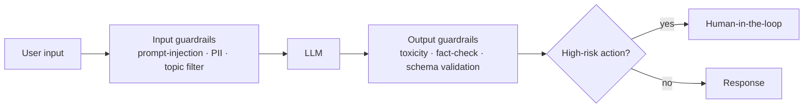

# Safety & Guardrails — Concepts

> Input/output guardrails, red-teaming, OWASP LLM Top 10, HITL

## Diagram (whiteboard version)
Defence in depth — guardrails on **both sides** of the model:

> Frame it with **OWASP LLM Top 10 + NIST AI RMF**. Prompt injection is the #1 risk; input filtering alone isn't enough — validate outputs too.

## Overview
_Your study notes go here. Explain it like you would to an interviewer._

## Key ideas
- 

## Deep dives
- 

## Common misconceptions
- 
