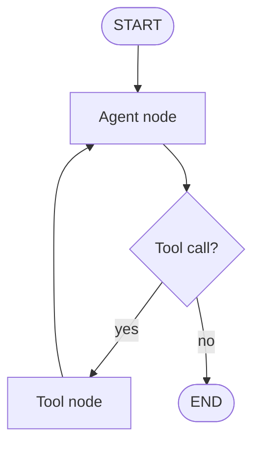

# LangChain & LangGraph — Concepts

> Read top-to-bottom the first time. Each idea = **plain definition → everyday analogy → why it matters**.
> Cheatsheet (`cheatsheet.md`) is for revising *after* you understand these.
> This is the **framework layer** over agents ([[07-agents-tool-use]]) and orchestration ([[12-agent-orchestration]]). Interviewers want to know you can use it **and** when to drop it.

---

## 1. What LangChain is (glue for LLM apps)

**Definition:** **LangChain** is a framework that provides building blocks for LLM apps — prompt templates, model wrappers, **retrievers**, output parsers, memory, and tool integrations — plus a way to compose them into **chains** (a sequence of steps).

**Example — a kitchen with prep stations:** instead of building a stove and forging knives yourself, you get a fitted kitchen with stations that connect. LangChain is that pre-fitted kitchen for LLM apps: the parts are there and they snap together.

**Why it matters:** It gets you from idea to working prototype fast, with ready-made connectors to models, vector DBs, and tools. *"LangChain is glue — it speeds up composition and integrations, so I don't rewrite prompt-plumbing and retriever code every project."*

---

## 2. Chains (a fixed pipeline of steps)

**Definition:** A **chain** wires steps together so the output of one feeds the next — e.g. *prompt → LLM → parse → retrieve → prompt → LLM*. The path is **predefined** (deterministic).

**Example:** a **factory assembly line** — each station does one job and passes the piece along. Same sequence, every item.

**Why it matters:** Chains are the right tool when the steps are known ahead of time (see chain-vs-agent in [[07-agents-tool-use]]). *"For a fixed workflow I use a chain — deterministic, easy to test — and only reach for an agent when the path isn't knowable up front."*

---

## 3. Why LangGraph exists (chains can't loop cleanly)

**Definition:** Real agents need to **loop** (call a tool, look at the result, decide again), **branch**, **retry**, and **carry state**. A linear chain can't express cycles well, and a hand-rolled agent hides its loop inside opaque code. **LangGraph** models the agent as an explicit **state graph** instead.

**Example:** a chain is a **straight recipe**; LangGraph is a **board game with a flowchart** — "if you land here, roll again; if you have the key, take the shortcut; otherwise go back three spaces." The rules for looping and branching are drawn out, not buried.

**Why it matters:** *"I move to LangGraph when I need cycles, branching, and persistent state — it makes the agent loop explicit and inspectable instead of a hidden while-loop."*

---

## 4. LangGraph = nodes + edges + shared state

**Definition:** In LangGraph: **nodes** are steps (an LLM call, a tool, a decision), **edges** define transitions, **conditional edges** route based on state, and a shared **state object** is threaded through every node. **Cycles** enable ReAct-style loops with explicit stop conditions.

**Example:** a **subway map** — stations (nodes), lines (edges), and a "if the express is running, switch here" rule (conditional edge). The shared state is your ticket, updated at each stop.

**Why it matters:** The graph is inspectable, resumable, and testable. *"Nodes act, edges route, state threads through — that's the whole model, and it's why I can test one node in isolation."*

---

## 5. State & checkpointing (save-and-resume)

**Definition:** LangGraph persists the shared state at each step (**checkpointing**), so a run can be **paused, resumed, replayed, or rewound** — not just run once end-to-end.

**Example:** a **video game save point**. You don't restart the whole level when you die — you reload the last checkpoint. Long agent runs work the same way.

**Why it matters:** Enables durable, long-running agents and debugging by replay. *"Checkpointing lets me pause and resume a long agent run, recover from a crash mid-task, and replay a failure exactly instead of guessing."* (→ [[16-monitoring-and-debugging]])

---

## 6. Human-in-the-loop nodes

**Definition:** Because state is checkpointed, you can **pause the graph at a node**, surface it to a human for approval or edits, then resume from that exact point.

**Example:** a **document that routes for a manager's signature** before it proceeds. Work stops at that step, waits for sign-off, then continues — nothing is lost while it waits.

**Why it matters:** The clean way to gate high-stakes actions. *"HITL is a first-class node — I pause before an irreversible action, get approval, and resume from the checkpoint."* (→ [[14-safety-guardrails]])

---

## 7. Memory — short-term vs. long-term

**Definition:** **Short-term memory** = the conversation buffer within the context window (trim or summarize as it grows). **Long-term memory** = an external store: a **vector DB** for semantic recall, or a keyed DB per user/session.

**Example:** short-term is what you hold **in your head** during a conversation; long-term is your **notebook** you look things up in later. You can't keep everything in your head, so you write the durable stuff down.

**Why it matters:** Being explicit about what's carried forward controls cost and prevents context overflow. *"Short-term buffer for the live turn, external store for durable recall — and I summarize or trim so context doesn't balloon."* (→ [[10-memory-systems]], [[09-context-engineering]])

---

## 8. LangSmith (observability for the stack)

**Definition:** **LangSmith** is the tracing/eval companion — it records each step's inputs, outputs, latency, and cost, and supports running eval datasets against your chains/graphs.

**Example:** a **flight recorder + test bench**. It logs exactly what happened on each run and lets you re-run a suite of known cases to check nothing regressed.

**Why it matters:** You can't debug or eval what you can't see. *"I trace with LangSmith so I can inspect every step's I/O and cost and run regression evals on the graph."* (→ [[06-evaluation]], [[16-monitoring-and-debugging]])

---

## 9. Framework vs. plain SDK (least abstraction that works)

**Definition:** The maturity call. **Plain SDK** for simple, single-shot calls — least magic, easiest to debug. **LangChain** for fast composition and integrations. **LangGraph** for stateful, cyclic, multi-step control flow. The cost of frameworks is **abstraction opacity** and **version churn**.

**Example:** power tools vs. hand tools. A nail gun (framework) is fast for a hundred nails; a hammer (plain SDK) is simpler and more predictable for one. You don't rent a nail gun to hang one picture.

**Why it matters:** *The* power move for this topic. *"Frameworks speed you up but add magic; in production I use the least abstraction that solves the problem — LangGraph when I genuinely need controllable stateful loops, plain SDK when I don't."*

---

## Quick misconceptions to avoid
- ❌ "LangChain and LangGraph are the same thing." → LangChain = compose chains/integrations; **LangGraph = stateful graph** for cyclic agent control flow.
- ❌ "Use a framework for everything." → For single-shot calls, **plain SDK** is simpler and easier to debug.
- ❌ "LangGraph is just a fancier chain." → Its point is **cycles, conditional edges, and persistent state** a chain can't express.
- ❌ "Memory just works." → Be **explicit** about short-term buffer vs. long-term store, and trim/summarize or context overflows.
- ❌ "The framework makes it production-ready." → You still own **tracing, evals, guardrails, and stop conditions**.

---
_Related: [[07-agents-tool-use]] · [[12-agent-orchestration]] · [[10-memory-systems]] · [[09-context-engineering]] · [[06-evaluation]] · [[16-monitoring-and-debugging]] · [[14-safety-guardrails]]_
