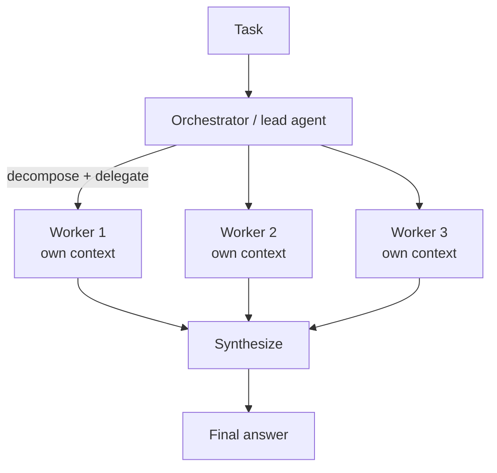

# Multi-Agent Orchestration — Concepts

> Coordinating multiple agents/loops to do what one can't. The senior skill is knowing **which topology**, **when it's worth it**, and **how to control the loop**.

---

## 0. First principle: don't reach for multi-agent by default

Anthropic's guidance (widely cited): **start with the simplest thing that works** — a single well-prompted LLM call, then a single agent with tools. Add orchestration *only* when the task genuinely needs decomposition or parallelism. Multi-agent systems cost more (many more tokens), add latency, and multiply failure surfaces. The interview trap is over-engineering; the win is justifying complexity.

**Rule of thumb:** more agents ≈ more tokens ≈ more cost + more places to fail. Earn it.

---

## Diagram — orchestrator–worker (the flagship pattern)

> The real win is **context isolation** — each worker explores in its own window; only a compressed result crosses back. Cost ≈ 10–15× a single chat, so earn it.

## 1. Workflows vs. Agents (know the distinction)

- **Workflow** — LLM steps orchestrated through **predefined code paths** (deterministic control flow you wrote). Predictable, cheaper, easier to debug.
- **Agent** — the LLM **dynamically decides** its own steps and tool use at runtime. Flexible, but less predictable.

Most production "agentic" systems are actually **workflows with agentic steps**. Say this — it shows maturity.

---

## 2. The building-block patterns (Anthropic's taxonomy)

| Pattern | What it is | Use when |
|---------|-----------|----------|
| **Prompt chaining** | Output of step 1 → input of step 2, in sequence | Task decomposes into fixed subtasks (e.g. outline → draft → polish) |
| **Routing** | A classifier sends input to the right specialized prompt/agent/model | Distinct input categories handled differently (cheap model for easy, big for hard) |
| **Parallelization** | Run subtasks concurrently, then aggregate. Two flavors: **sectioning** (split work) and **voting** (same task N times, take consensus) | Independent subtasks, or you want multiple attempts/perspectives |
| **Orchestrator–Workers** | A lead agent **dynamically** breaks the task into subtasks, delegates to worker agents, synthesizes results | Subtasks aren't known in advance (e.g. research, multi-file code changes) |
| **Evaluator–Optimizer** | One agent generates, another **critiques**, loop until the evaluator passes | Clear eval criteria exist and iteration measurably improves output (translation, code) |

Reflection = a lighter form of evaluator-optimizer where the *same* agent critiques its own output.

---

## 3. Orchestrator–Worker (the flagship multi-agent pattern)

A **lead/orchestrator** agent:
1. Interprets the goal, decomposes it into subtasks.
2. Spawns **worker (sub-)agents**, each with its **own context window** (→ context isolation, see [[09-context-engineering]]).
3. Workers run in parallel where possible, return structured results.
4. Orchestrator synthesizes into the final answer.

Why sub-agents help: **context isolation**. Each worker explores its slice deeply without polluting the others' or the lead's window. This is why deep-research systems use it. Cost: orchestrator + N workers can burn ~10–15× the tokens of a single chat — justified only for high-value tasks.

---

## 4. Handoffs / Swarm (decentralized alternative)

Instead of a central boss, agents **hand off control** to one another as peers (OpenAI's *Swarm*/Agents SDK style). Agent A decides "this is a billing question" and hands the conversation to the Billing agent, transferring context. Good for customer-support-style routing where the "active" agent changes but there's no central synthesizer. Trade-off: harder to reason about global state than orchestrator-worker.

---

## 5. Loop control (the reliability core — interviewers love this)

An autonomous agent loop (`observe → think → act → observe …`) will run forever or explode in cost if unbounded. Guards:

- **Max iterations / max steps** — hard cap on loop turns (e.g. 10–25). The #1 guard.
- **Token / cost budget** — stop when spend exceeds a ceiling; degrade gracefully.
- **Wall-clock timeout** — per step and per task.
- **Termination condition** — explicit "done" signal (e.g. the model calls a `finish` tool, or a goal check passes).
- **Stall / loop detection** — detect repeated identical actions or no progress; break out.
- **Error handling** — retries with backoff on tool failure; propagate or contain errors so one bad tool doesn't kill the run.
- **Human-in-the-loop gate** — pause for approval before high-risk actions (spend, deletes, external sends).

Interview one-liner: *"Every autonomous loop needs a max-iteration cap, a budget guard, and a clear termination condition — otherwise it's a runaway."*

---

## 6. Shared state, memory & communication

- **Shared scratchpad / state object** — agents read/write a common state (LangGraph's state graph model).
- **Message passing** — agents communicate via structured messages.
- **A2A (Agent-to-Agent protocol)** — an emerging open standard for agents from *different* frameworks/vendors to discover and talk to each other (complements **MCP**, which connects an agent to *tools/data*). Quick contrast: **MCP = agent↔tools; A2A = agent↔agent.**
- Memory across agents ties directly to [[09-context-engineering]] (what each agent knows, and what's isolated).

---

## 7. Single-agent vs multi-agent — the trade-off answer

**Prefer single agent when:** the task is linear, latency-sensitive, cost-sensitive, or the tools fit in one context. Easier to debug, cheaper, fewer failure modes.

**Go multi-agent when:** the task has **separable sub-problems** that benefit from parallelism or **specialized context** (different tools/knowledge per role), or the context of one sub-task would overflow/pollute the main window. Deep research, large codebase changes, multi-domain support.

**The mature take:** "I'd start with one agent and a good tool set, measure where it fails — usually context overload or serialized latency — and only then split into an orchestrator with isolated workers. Multi-agent buys parallelism and context isolation at the cost of tokens and complexity."

---

_Related: [[07-agents-tool-use]] · [[09-context-engineering]] · [[11-langchain-langgraph]] · [[08-mcp-and-custom-skills]] · [[22-llm-system-design]] · [[15-cost-optimization]]_
