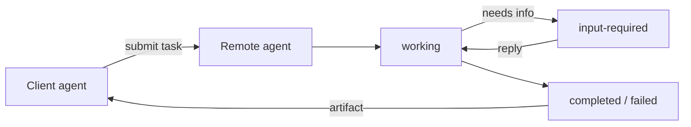

# A2A (Agent-to-Agent) — Concepts (learn-first)

> Read top to bottom once. Each concept: plain definition → a real-world example → why it matters in an interview.
> The single most-tested idea here is **A2A vs MCP** — get concept #2 cold.

---

## 1. What A2A is

**Definition.** A2A (Agent-to-Agent) is an **open protocol for one agent to talk to another agent** — discover it, send it a task, and get results back — even when the two were built by different teams on different frameworks. It was introduced by Google in 2025 and donated to the Linux Foundation.

**Real-world example.** Think of hiring a specialist. Your travel-planning agent doesn't know how to book visas, so it hands that job to a dedicated visa agent — the way a GP refers you to a specialist doctor. Neither needs to know how the other works internally; they just agree on how to pass the request and the result.

**Why it matters.** It's the "agents as interoperable services" vision. Naming it shows you're tracking the ecosystem beyond a single framework's sub-agents.

---

## 2. A2A vs MCP (the one they'll ask)

**Definition.** They solve *different* connection problems and are complementary:
- **MCP** connects an agent **downward to tools and data** — APIs, files, databases. ([[08-mcp-and-custom-skills]])
- **A2A** connects an agent **sideways to other agents** — delegating whole tasks to peers.

**Real-world example.** A contractor building a house:
- **MCP** = the contractor's *tools* — the drill, the saw, the tape measure. Things they operate.
- **A2A** = calling in *other tradespeople* — the electrician, the plumber. Independent professionals they delegate a job to.

You use both: agents use MCP to reach tools, and A2A to reach each other.

**Why it matters.** This is the definitional question. One line: **"MCP is agent-to-tools; A2A is agent-to-agent — they're complementary layers, not competitors."** Say that and you've answered it.

---

## 3. The Agent Card

**Definition.** An **Agent Card** is a small public manifest (JSON, usually at a well-known URL) that advertises an agent: its name, what skills it offers, its endpoint, and how to authenticate. It's how an agent describes itself to the world.

**Real-world example.** A business card / LinkedIn profile: "Here's who I am, what I do, and how to reach me." Another agent reads it to decide whether this is the right peer for the job.

**Why it matters.** Discovery needs a standard description. "How does agent A know what agent B can do?" → "It reads B's agent card." Concrete and correct.

---

## 4. Discovery

**Definition.** The process of one agent **finding** another and **reading its capabilities** (via the agent card) before delegating. Can be a known URL, a registry/catalog, or configured directly.

**Real-world example.** Looking up a plumber: you check a directory, read their listed services and reviews, *then* call. You don't cold-call a random number hoping they do plumbing.

**Why it matters.** Discovery is what makes A2A an *ecosystem* rather than hardcoded point-to-point wiring. It's the part that scales to agents you didn't build.

---

## 5. The task lifecycle

**Definition.** A2A is **task-oriented**. A request becomes a task with a lifecycle:
`submitted → working → (input-required) → completed | failed | canceled`. The requesting agent can poll or stream to watch it progress.

**Real-world example.** Ordering food delivery: order placed → being prepared → (restaurant calls: "no paneer, ok?") → out for delivery → delivered. You track states, not one instant reply.

**Why it matters.** Agent tasks are long-running and may pause for input — a request/response mental model is too simple. The lifecycle (esp. `input-required`) shows you get that.

---

## 6. Messages, parts, and artifacts

**Definition.** The units exchanged:
- **Message** — a turn of communication between the two agents.
- **Part** — a piece of a message (text, file, structured data); messages are multi-modal.
- **Artifact** — the *output* the remote agent produces (a document, a result payload).

**Real-world example.** Email: the **message** is the email, the **parts** are the body text plus attachments, and the **artifact** is the finished report attached to the reply.

**Why it matters.** Shows the exchange is structured and multi-modal, not just string-in/string-out. You don't need every field memorized — know message → parts → artifact.

---

## 7. Framework-agnostic interoperability

**Definition.** Because A2A is a *protocol* (over HTTP, with JSON), agents on **different frameworks** — LangGraph, CrewAI, Google ADK, custom — can interoperate as long as each speaks A2A.

**Real-world example.** Email again: Gmail, Outlook, and Proton users all exchange mail fine because they share SMTP. Nobody has to use the same app. A2A is that shared protocol for agents.

**Why it matters.** This is the whole point and the payoff line: "A2A lets me plug in a partner team's agent without rewriting it into my framework."

---

## 8. Auth and security between agents

**Definition.** Since agents can invoke each other across org boundaries, A2A carries **authentication and authorization** (via the agent card's declared schemes) so a remote agent can verify *who's calling* and *whether they're allowed* to run a given skill.

**Real-world example.** A contractor won't do work for a stranger claiming to be the homeowner — they verify identity and that the request is authorized. Same for agents delegating sensitive tasks.

**Why it matters.** "Agents calling agents" raises an obvious security flag; addressing auth unprompted shows production maturity. Ties to [[14-safety-guardrails]].

---

## 9. When A2A is overkill

**Definition.** If all your agents live in **one codebase / one framework**, a multi-agent orchestrator ([[12-agent-orchestration]]) is simpler — you don't need a cross-org protocol to call a function you own. A2A earns its keep when agents are **independently owned, deployed, or built on different stacks**.

**Real-world example.** You don't send a formal contract and invoice to your own family member to pass the salt. A2A is the paperwork for working with an outside party — worth it across boundaries, overhead within your own house.

**Why it matters.** Knowing when *not* to use it is the senior signal. "A2A across org/framework boundaries; in-framework sub-agents otherwise."

---

## Quick misconceptions to avoid
- ❌ "A2A replaces MCP." → Complementary: MCP = agent↔tools, A2A = agent↔agent.
- ❌ "A2A is a framework." → It's a *protocol*; frameworks implement it.
- ❌ "Agents just send a string and get a string." → It's task-oriented with a lifecycle, multi-modal parts, and artifacts.
- ❌ "Use A2A for all multi-agent setups." → In one framework, a plain orchestrator is simpler; A2A is for cross-boundary interop.

_Related: [[12-agent-orchestration]] · [[08-mcp-and-custom-skills]] · [[11-langchain-langgraph]] · [[14-safety-guardrails]]_
