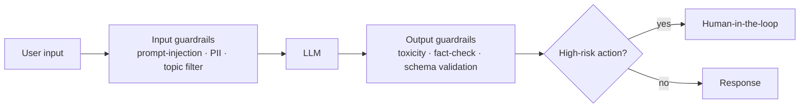

# Safety & Guardrails — Concepts

> Read top-to-bottom the first time. Each idea = **plain definition → everyday analogy → why it matters**.
> Cheatsheet (`cheatsheet.md`) is for revising *after* you understand these.
> Non-negotiable for production. Guardrailing agents overlaps with [[07-agents-tool-use]]; managed filtering with [[18-aws-bedrock-sagemaker]].

---

## 1. Why safety is non-negotiable (a wrong action, not a wrong sentence)

**Definition:** **Guardrails** are the controls that keep an LLM system from producing harmful, leaking, or dangerous outputs and actions. Regulators, legal, and users all care — and an agent with tools can *do* damage, not just say the wrong thing.

**Example — a factory floor:** you don't hand a worker a power press with no safety cage, no emergency stop, and no training. Guards, interlocks, and sign-offs exist because the machine has real consequences. An LLM with tool access is that press.

**Why it matters:** Frames the whole topic. *"Safety scales with capability — a chatbot's worst case is a bad sentence; an agent's worst case is a bad action, so I design around blast radius."*

---

## 2. Defence in depth — guardrails on both sides

**Definition:** You filter **before** the model (input) and validate **after** it (output), and gate risky actions. No single layer is enough.

**Example — airport security:** there's a check on the way in (screening) *and* a check on what leaves (customs). Relying on only one lets things slip through.

**Why it matters:** *"I never trust input filtering alone — I validate outputs too, and gate high-risk actions. Defence in depth, because any single layer can be bypassed."*

---

## 3. Input guardrails (screen before the model)

**Definition:** Filter or flag harmful/adversarial input *before* it reaches the model: **prompt-injection detection**, **PII detection**, **topic/off-scope filtering**, rate limits — block or sanitize at the gateway.

**Example:** a **bouncer at the door** — checks IDs and turns away troublemakers before they're inside, rather than dealing with them mid-party.

**Why it matters:** Cheapest place to stop obvious attacks and out-of-scope requests. *"Input guardrails catch the easy stuff at the gate — injection patterns, PII, off-topic — so the model never sees them."*

---

## 4. Output guardrails (screen before the user)

**Definition:** Validate the model's output *before* it reaches the user or triggers an action: **PII leakage**, **toxic/harmful content**, **off-topic/policy violations**, and **schema validation** (is it valid JSON in the expected shape?). Often a secondary classifier or rules engine.

**Example:** a **proofreader/editor** who reads everything before it's published, catching anything that shouldn't go out — even if the writer meant well.

**Why it matters:** The model can be tricked or just wrong, so you check its work. *"A secondary check on outputs — PII, toxicity, schema — is my safety net for when the model itself gets manipulated or hallucinates."*

---

## 5. Prompt injection — the #1 risk (direct vs. indirect)

**Definition:** An attacker embeds instructions that **override your system prompt**. **Direct** = in the user message ("ignore your instructions and…"). **Indirect** = hidden in content the model *retrieves* — a web page, a PDF, a RAG document.

**Example:** direct injection is someone **telling your assistant to their face** to ignore the rules. Indirect is **slipping a forged note into a file they'll read later** — the assistant trusts the document and follows the hidden instruction. The second is far sneakier.

**Why it matters:** The signature threat. *"Indirect injection through RAG sources is the sneaky one — the malicious instruction rides in on a trusted document."* The core defence is §6.

---

## 6. The core defence — treat all content as data, not instructions

**Definition:** The root fix for injection: **never treat retrieved or user content as commands**. Keep instructions and data separated, sanitize/sandbox retrieved content, use input classifiers, strictly validate outputs, apply **least-privilege tools**, and never let raw model output trigger a high-stakes action without validation or approval.

**Example:** a bank teller who follows only the **bank's procedures**, never instructions written on a customer's deposit slip. The slip is *data to process*, not *orders to obey*.

**Why it matters:** *"My mental model is: everything outside the system prompt is untrusted data, not instructions — that single principle defuses most injection, direct or indirect."*

---

## 7. Action guardrails for agents (the third layer)

**Definition:** When the LLM can call tools, add a layer beyond input/output: **least-privilege permissions**, **tool-call caps & retry limits**, **read-only enforcement** where possible, **query/argument validation**, **sandboxing**, and **HITL approval** before irreversible actions.

**Example:** a new employee gets a **badge for only their floor**, **spending under a limit**, and works on a **staging copy** — not production. Trust is scoped to the smallest set of actions needed.

**Why it matters:** This is where safety meets agents. *"For an agent I add action guardrails — least privilege, capped tool calls, validated arguments, and human approval before anything irreversible."* This is the OWASP **excessive-agency** risk. (→ [[07-agents-tool-use]])

---

## 8. Red-teaming & jailbreak testing

**Definition:** **Proactively attack your own system** before adversaries do: jailbreaks, direct and indirect injection, data-extraction attempts, social engineering, out-of-domain probes. Grade how *gracefully* it fails.

**Example:** hiring **ethical burglars to break into your building** so you find the weak windows before real thieves do.

**Why it matters:** Ties to eval. *"I red-team for jailbreaks and indirect injection and grade graceful failure, not just happy-path accuracy — findings become regression tests."* (→ [[06-evaluation]])

---

## 9. Human-in-the-loop for high stakes

**Definition:** For medical, legal, financial, or otherwise irreversible actions, route **uncertain or sensitive** outputs to a human. Design escalation so the system **fails gracefully** (abstain, ask, defer) rather than confidently doing harm.

**Example:** a **junior doctor who checks with the attending** before a major call. Knowing when to escalate is a feature, not a weakness.

**Why it matters:** *"For high-stakes domains I gate on human review and design for graceful failure — abstain or escalate beats a confident wrong action."*

---

## 10. PII & data privacy

**Definition:** **Detect and redact PII** at ingress and *before logging*; minimize data sent to third-party APIs; consider **on-prem/VPC hosting** for sensitive data; set **retention limits** and **access controls** on logs; know your compliance context (GDPR, HIPAA).

**Example:** a hospital **blacks out patient names** before charts go to a research team, keeps records in a locked room, and shreds them on schedule. Same discipline for prompts and logs.

**Why it matters:** *"I redact PII before it's logged or sent to third parties, and for sensitive data I keep the model in-VPC — privacy is a design constraint, not an afterthought."* (→ [[16-monitoring-and-debugging]])

---

## 11. Frame it with standards — OWASP LLM Top 10 & NIST AI RMF

**Definition:** Anchor your answer in recognized frameworks. **OWASP LLM Top 10** = the threat checklist (prompt injection, insecure output handling, training-data poisoning, sensitive-info disclosure, **excessive agency**, …). **NIST AI RMF** = a risk-management process (govern, map, measure, manage).

**Example:** a builder citing **building codes** instead of "I think it's sturdy." Naming the standard signals you do this professionally, not by vibes.

**Why it matters:** *The* maturity power move. *"I threat-model with the OWASP LLM Top 10 and manage risk with the NIST AI RMF."* Managed option: **AWS Bedrock Guardrails** for input/output filtering (→ [[18-aws-bedrock-sagemaker]]).

---

## Quick misconceptions to avoid
- ❌ "Input filtering is enough." → Validate **outputs** too, and gate actions — defence in depth.
- ❌ "Prompt injection is just users typing tricks." → **Indirect** injection via retrieved docs is the sneaky, dangerous form.
- ❌ "Retrieved documents are trustworthy." → Treat **all** non-system content as **data, not instructions**.
- ❌ "A safe chatbot = a safe agent." → Tool access adds **action guardrails** (least privilege, HITL, sandboxing).
- ❌ "Guardrails are a launch-day add-on." → They're **design-time**, and red-teaming is continuous.
- ❌ "We can log everything to debug." → **Redact PII** first; logs are a privacy surface.

---
_Related: [[07-agents-tool-use]] · [[06-evaluation]] · [[16-monitoring-and-debugging]] · [[18-aws-bedrock-sagemaker]] · [[05-rag]] · [[09-context-engineering]]_
