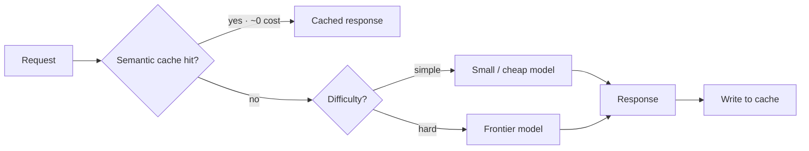

# Cost Optimization — Concepts

> Read top-to-bottom the first time. Each idea = **plain definition → everyday analogy → why it matters**.
> Cheatsheet (`cheatsheet.md`) is for revising *after* you understand these.
> Quantified cost wins are gold in interviews. Overlaps with [[02-llm-foundations]] (tokens), [[16-monitoring-and-debugging]] (cost tracking), [[24-fine-tuning]].

---

## 1. Why cost is an engineering problem (you pay per token, forever)

**Definition:** LLM apps bill **per token**, on **every** request, forever. A feature that's cheap in a demo can be ruinous at a million users. Cost optimization is the discipline of hitting the quality bar for the fewest tokens/dollars.

**Example — a taxi meter running on every trip:** buying the car once is the demo; the meter ticking on every ride, every day, is production. You design the route to keep the meter down without making passengers walk.

**Why it matters:** *"LLM cost is a per-request tax, so I optimize the recurring cost, not the one-off — small per-call savings compound massively at scale."* Companies want engineers who ship without burning the budget.

---

## 2. The token cost model (output is the expensive half)

**Definition:** You pay for **input tokens** (prompt) *and* **output tokens** (completion), but **output is usually 3–5× the price of input**. Bigger models cost more per token than small ones.

**Example — a translator who charges more to speak than to listen:** listening (input) is cheap; every word they say back (output) costs several times more. So you ask precise questions and don't invite rambling answers.

**Why it matters:** It tells you *where* to cut first. *"Because output tokens are 3–5× input, my first lever is usually capping and tightening the output, then the model tier."*

---

## 3. Model selection & routing (the biggest lever) ⭐

**Definition:** Use the **smallest model that clears the quality bar**, and **route** by difficulty: send simple queries to a cheap/fast model (e.g. Haiku or a fine-tuned small model), escalate only the hard ones to a frontier model. A cheap classifier or heuristic picks the tier.

**Example — a hospital triage nurse:** not every patient sees the top specialist. A nurse routes the sniffles to a GP and the chest pain to the cardiologist. Same idea — match the request to the cheapest capable resource.

**Why it matters:** Routing alone can cut **60–80%**. *"Model routing cut our API cost 70% while holding 95% of quality"* — the single highest-impact, most-quotable move.

---

## 4. Prompt optimization (fewer tokens in)

**Definition:** Shorter prompts = fewer input tokens on every call. **Compress** system prompts, drop redundant few-shot examples, and trim boilerplate. Prompt **compression** tools/summaries help for long contexts.

**Example:** a **standing meeting agenda** — you don't re-read the entire company handbook at the start of every meeting; you keep the recurring preamble tight because it's paid for every single time.

**Why it matters:** The system prompt is paid on *every* request, so trimming it scales. *"I audit the system prompt for dead weight — it's a fixed tax on every call."*

---

## 5. Caching — semantic & prompt (pay once, reuse)

**Definition:** Two kinds:
- **Semantic cache** — key by **embedding similarity**; near-identical questions serve a stored answer at ~0 cost.
- **Prompt caching** (provider feature) — cache a large **static prefix** (system prompt, docs) so repeated reads are ~**90% cheaper**.

**Example:** semantic cache = an FAQ board — the tenth person asking "what are your hours?" gets the posted answer, not a fresh consultation. Prompt caching = keeping the **case file open on the desk** so you don't re-read it from scratch each time you're asked about it.

**Why it matters:** *"Semantic caching serves repeat questions near-free, and prompt caching cuts ~90% off a big static prefix — but I tune the similarity threshold and TTL to avoid stale or false hits."*

---

## 6. Batching & async (trade latency for ~50% off)

**Definition:** Many providers offer a **batch API at ~50% off** for non-urgent jobs. Run summarization, classification, or backfills **asynchronously/overnight** instead of real-time.

**Example:** **off-peak electricity** — running the dishwasher at night is the same job at half the rate because you don't need it *right now*.

**Why it matters:** Free money when there's no tight latency SLA. *"Anything not user-facing-real-time goes through the batch endpoint for ~50% off — I separate interactive from background workloads."*

---

## 7. Fine-tuning a small model for efficiency

**Definition:** A **small specialized fine-tune** can match or beat a large general model on a narrow task at a **fraction of inference cost**. The upfront training cost pays back fast at volume.

**Example:** training **one dedicated specialist** for a repetitive job instead of paying a pricey generalist consultant per task. High setup cost, but cheap per job once trained — worth it above a break-even volume.

**Why it matters:** *"For a high-volume narrow task, a small fine-tune beats a frontier model on cost per call, and the training cost amortizes quickly."* (→ [[24-fine-tuning]])

---

## 8. Output length control (cap the expensive half)

**Definition:** Set **`max_tokens`**, ask for **concise/structured output**, and don't let the model write 2000 tokens when 200 will do. Structured output returns exactly the fields you need.

**Example:** asking someone for a **one-line answer, not an essay** — you get the fact without paying for the padding.

**Why it matters:** Output is the 3–5× price tier (§2), so this is high-leverage. *"I cap `max_tokens` and request structured output — no paying premium rates for filler."*

---

## 9. Estimating cost before you build (do the math)

**Definition:** Back-of-envelope: **`requests/day × (avg input + avg output tokens) × price/token`**, splitting input vs. output pricing. Add a buffer for retries and system-prompt overhead, then attack the **biggest term** (usually output tokens or model tier).

**Example:** **pricing a road trip before leaving** — distance × fuel price, plus a margin for detours. You spot the gas-guzzling leg *before* you commit, not after the bill.

**Why it matters:** Doing the math out loud signals production thinking. *"I estimate `req/day × tokens × price`, find the dominant term, and design against it before writing code."*

---

## 10. Cost vs. quality — don't over-optimize (cost per *successful* task)

**Definition:** Set a **quality floor** (an eval suite) first, then cut cost only while staying above it. Track **cost per successful task**, not per call — a cheap model that fails, retries, and escalates is *not* cheap.

**Example:** the **cheapest contractor who does it twice** costs more than the fair-priced one who does it once. Price per attempt hides the rework.

**Why it matters:** *The* maturity guardrail. *"I optimize cost against a quality floor and measure cost-per-successful-task — a cheap call that triggers a retry and escalation is a false saving."* (→ [[06-evaluation]])

---

## Quick misconceptions to avoid
- ❌ "Input and output tokens cost the same." → **Output is ~3–5×** — cut it first.
- ❌ "Use the best model everywhere." → **Route** by difficulty; cheapest capable model wins (60–80% savings).
- ❌ "Caching is just for identical strings." → **Semantic** caching serves *similar* questions; prompt caching reuses a static prefix (~90% off).
- ❌ "Cheapest per call = cheapest overall." → Track **cost per successful task** — failures + retries + escalation add up.
- ❌ "Optimize cost first." → Set a **quality floor** first, then cut beneath the ceiling, not below the floor.
- ❌ "Batch and real-time are the same price." → **Batch is ~50% off** — move non-urgent work there.

---
_Related: [[02-llm-foundations]] · [[16-monitoring-and-debugging]] · [[24-fine-tuning]] · [[06-evaluation]] · [[05-rag]] · [[22-llm-system-design]]_
