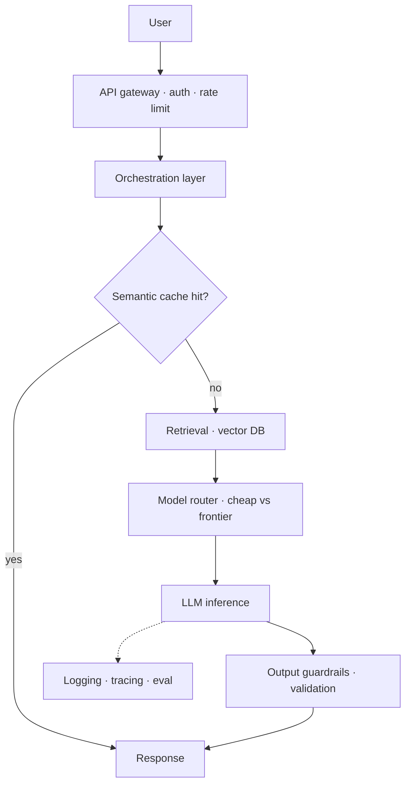

# LLM System Design — Concepts

> Scaling LLM systems, back-of-envelope cost math

## Diagram (reference architecture — draw this first)

> Open the answer with **back-of-envelope token math**, then sketch this and talk trade-offs (cache → route → retrieve → guard → observe).

## Overview
_Your study notes go here. Explain it like you would to an interviewer._

## Key ideas
- 

## Deep dives
- 

## Common misconceptions
- 
