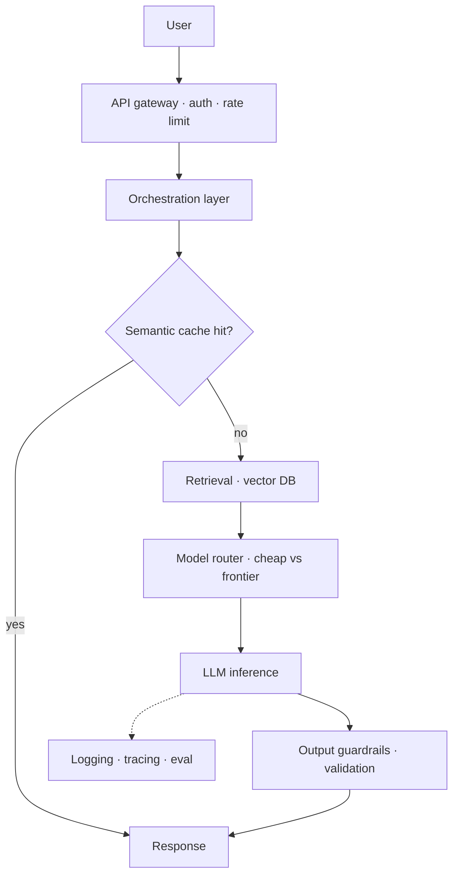

# LLM System Design — Concepts

> Read top-to-bottom the first time. Each idea = **plain definition → everyday analogy → why it matters**.
> Cheatsheet (`cheatsheet.md`) is for revising *after* you understand these.
> Where every other topic combines. Open with token math, then draw the architecture, then talk trade-offs at each layer.

---

## Diagram (reference architecture — draw this first)

> Open the answer with **back-of-envelope token math**, then sketch this and talk trade-offs (cache → route → retrieve → guard → observe).

---

## 1. Back-of-envelope token math (do it out loud) ⭐

**Definition:** Before any architecture, estimate the load in **tokens**: volume × tokens-per-item = tokens/day, then × price = rough $/day. State it aloud.

**Example — planning a road trip by fuel:** before choosing the route you work out "500 miles ÷ 30 mpg × $4/gal ≈ $67". Same instinct: *"10K docs/day × ~2K tokens ≈ 20M tokens/day ≈ $X/day."*

**Why it matters:** It's the single strongest signal of production thinking, and it anchors every later decision (routing, batching, caching). *"I always open a design with the token math — it tells me whether cost or latency is the binding constraint before I draw a single box."*

---

## 2. Clarify first (requirements before boxes)

**Definition:** Pin down **scale, latency SLA, quality bar, and budget** before designing. A chatbot and a nightly batch job are different systems.

**Example:** a builder asks "how many rooms, what budget, when do you move in?" before drawing plans — not after.

**Why it matters:** Designing to unstated assumptions is the classic failure. *"I clarify scale, latency, quality, and budget up front — the SLA decides the model tier and serving mode, not the other way around."*

---

## 3. Decouple with a queue (queue → workers → LLM → store) ⭐

**Definition:** Put a **message queue** (SQS/Kafka) between ingestion and processing. Producers enqueue work; a **worker pool** pulls, calls the LLM, and writes to a **result store**. Ingestion and processing scale independently.

**Example:** a **restaurant ticket rail** — waiters clip orders to the rail (queue), cooks pull them at their own pace (workers). A rush at the door doesn't overwhelm the kitchen; tickets just wait.

**Why it matters:** Absorbs bursts, isolates failures, enables autoscaling. *"I decouple ingestion from processing with a queue so a traffic spike fills the queue instead of dropping requests, and I autoscale workers on queue depth."*

---

## 4. Chunking & map-reduce for long docs

**Definition:** Docs bigger than the context window are split into **chunks**; summarise each, then **summarise the summaries** (map-reduce). Very long inputs go **hierarchical** (summaries of summaries).

**Example:** summarising a 900-page book by chapter first, then combining the chapter summaries into one — nobody reads all 900 pages at once.

**Why it matters:** *"For docs over the context window I map-reduce — summarise chunks, then summarise those; hierarchical when it's really long. It keeps each call inside the window and parallelises."*

---

## 5. Cost engineering (batch, routing, caching)

**Definition:** Three big levers: **batch APIs** (~50% cheaper for non-urgent work), **model routing** (small model for easy items, frontier only for hard ones), and **caching** (exact + semantic) for duplicate/near-duplicate inputs.

**Example:** shipping — you use **ground shipping for the bulk** (batch), **express only for urgent parcels** (routing), and **don't re-ship what's already delivered** (cache).

**Why it matters:** These move the bill 2–10×. *"Routing plus batching plus caching is where the real cost savings live — I size each to the traffic before reaching for a cheaper model everywhere."* (→ [[15-cost-optimization]])

---

## 6. Reliability (DLQ, retries, idempotency, autoscale)

**Definition:** Production hygiene: **retries** with exponential backoff, a **dead-letter queue** for repeated failures, **idempotent** processing (re-runs don't duplicate — dedupe by content hash, upsert by id), and **autoscaling** workers on queue depth.

**Example:** a **mailroom** — undeliverable items go to a "returns" bin (DLQ) instead of clogging the line; re-scanning the same parcel twice doesn't create two deliveries (idempotency).

**Why it matters:** Distinguishes a demo from a system. *"Retries, DLQ, idempotency, and queue-depth autoscaling — that's what makes it survive a bad day, not just a happy-path demo."*

---

## 7. Quality assurance & drift (sample and watch)

**Definition:** Sample **1–2% of outputs** for human/automated review; track output metrics (length, factual consistency, extractive density) and **alert on drift** from a baseline.

**Example:** a **factory QA line** pulling a few units off the belt each hour — you don't inspect every one, but you catch a bad batch fast.

**Why it matters:** LLM quality degrades silently. *"I sample a small % of outputs daily and alert on drift from baseline — silent quality regressions are the failure mode monitoring exists to catch."* (→ [[06-evaluation]], [[16-monitoring-and-debugging]])

---

## 8. Latency design — real-time vs. batch

**Definition:** Design from the **SLA**. Real-time (chatbot): smaller/faster model, **streaming**, prompt caching, tight `max_tokens`, timeouts + fallback. Batch (analytics): maximise **throughput** with batch APIs and large context, tolerate higher per-item latency.

**Example:** a **coffee counter vs. a catering kitchen** — the counter optimises for the next customer's wait; catering optimises for total meals out the door by dinner.

**Why it matters:** *"I pick the model tier and serving mode from the latency budget — real-time streams a fast model, batch maximises throughput and tolerates per-item latency."*

---

## 9. Safety layer (guardrails, PII, HITL)

**Definition:** Wrap the system with input/output **guardrails**, **PII** handling, and **human-in-the-loop** review where stakes are high.

**Example:** the **safety rails and lifeguard at a pool** — most swimmers never need them, but they're non-negotiable for the few moments that matter.

**Why it matters:** *"Guardrails, PII redaction, and HITL on high-stakes actions are part of the design, not an afterthought bolted on later."* (→ [[14-safety-guardrails]])

---

## The general framework (say this order)
1. **Clarify** — scale, latency SLA, quality bar, budget.
2. **Token math** — tokens → cost/QPS, out loud.
3. **Data flow** — ingest → process → store → serve; decouple with queues.
4. **Model strategy** — routing, batching, caching.
5. **Reliability** — retries, DLQ, idempotency, autoscale.
6. **Eval & monitoring** — sampling, quality scores, drift alerts.
7. **Safety** — guardrails, PII, HITL where stakes are high.

---

## Quick misconceptions to avoid
- ❌ "Start with the architecture diagram." → Start with the **token math** and requirements; the numbers drive the boxes.
- ❌ "Call the LLM synchronously from the request path." → Decouple with a **queue** so bursts don't drop work.
- ❌ "One model for everything." → **Route** — cheap model for easy items, frontier only when needed.
- ❌ "Retries are enough for reliability." → Add **DLQ + idempotency**, or retries just duplicate the damage.
- ❌ "Ship it once it works." → Add **output sampling + drift alerts**; LLM quality regresses silently.
- ❌ "Pick the model, then the latency." → Pick from the **SLA** — latency budget decides tier and serving mode.

---
_Related: [[15-cost-optimization]] · [[06-evaluation]] · [[16-monitoring-and-debugging]] · [[05-rag]] · [[14-safety-guardrails]] · [[20-deployment-serving]] · [[18-aws-bedrock-sagemaker]]_
